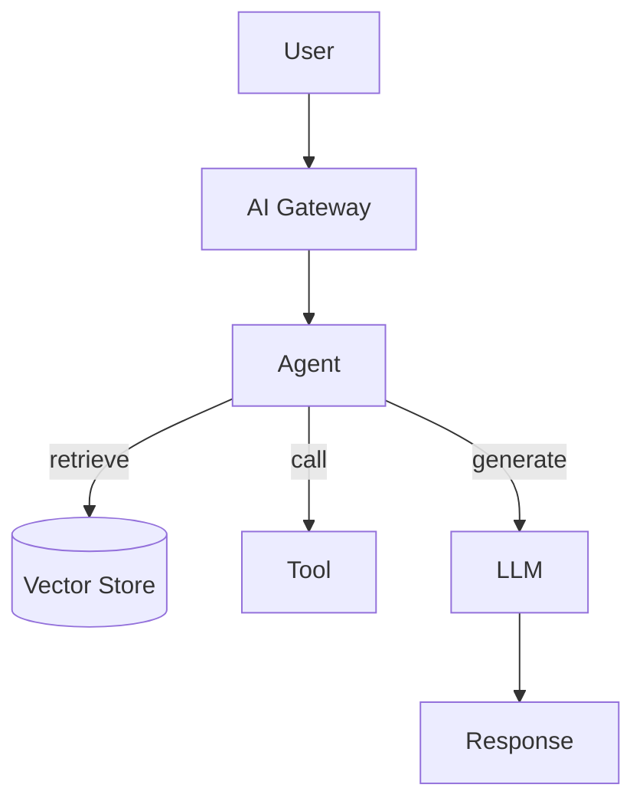

## Diagram

## Summary

A family of patterns for structuring applications built on top of large language models. Each pattern addresses a different architectural problem: how to ground responses in current data, how to give a model the ability to act, how to chain reasoning steps, and how to manage the flow of context across sessions. These patterns compose — most production LLM applications combine several.

## When To Use

- The application uses an LLM as a core component for reasoning, generation, or decision-making
- The model's base capabilities need to be augmented with external data, tools, or memory
- Multiple LLM calls need to be coordinated across a workflow

## When To Avoid

- Simple single-prompt call-and-response with no need for grounding, memory, or action
- Use cases where deterministic logic is more appropriate than probabilistic generation

## Pros and Cons

* Good, because patterns like RAG and Tool Use extend a model's capabilities without retraining
* Good, because compositional patterns (chaining, multi-agent) can tackle complex multi-step tasks
* Bad, because LLM calls are non-deterministic — each pattern must be designed to tolerate variable outputs
* Bad, because latency, cost, and failure modes compound as patterns are composed

## Evolutions

- **From:** Direct single-prompt LLM calls as the baseline
- **To:** Compose Agent + RAG + Memory for autonomous task completion; add AI Gateway for multi-provider resilience; scale to Multi-Agent for parallel or specialized workloads
- **Workflows:** Combine the composable control-flow patterns — Prompt Chaining, Routing, Parallelization, Evaluator-Optimizer, and Planning — to structure multi-step LLM applications before reaching for a fully autonomous Agent
