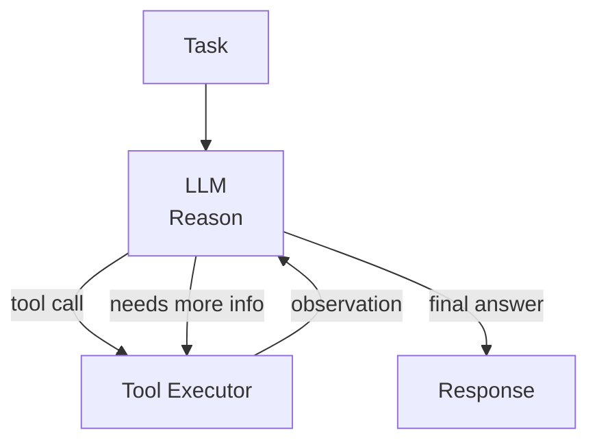

## Diagram

## Summary

Places an LLM in a loop where it reasons about a task, selects and calls tools, observes the results, and iterates until it produces a final answer or reaches a stopping condition. Unlike a single prompt-response, an agent can take multiple steps, use external tools (search, code execution, APIs), and adapt its approach based on intermediate results. The LLM acts as the reasoning engine; the loop provides the ability to act.

## When To Use

- The task requires multiple steps, tool calls, or decisions that cannot be determined up front
- The path to completing the task depends on intermediate results that are only known at runtime
- The system must take actions (write files, call APIs, query databases) not just generate text

## When To Avoid

- The task is deterministic and the steps are known in advance — use Prompt Chaining instead
- The consequences of incorrect actions are irreversible — add Human-in-the-Loop checkpoints
- Latency constraints cannot accommodate multiple sequential LLM calls

## Pros and Cons

* Good, because the agent adapts its approach dynamically based on tool results and observations
* Good, because complex multi-step tasks can be completed autonomously without pre-specifying the exact steps
* Bad, because loops can diverge — agents require careful stopping conditions and maximum iteration limits
* Bad, because each tool call adds latency and cost; multi-step agents multiply both

## Evolutions

- **From:** Single-turn prompt-response LLM calls
- **To:** Multi-Agent (decompose tasks across specialized agents); Human-in-the-Loop (add human checkpoints for irreversible actions); RAG (add retrieval as a tool available to the agent)
