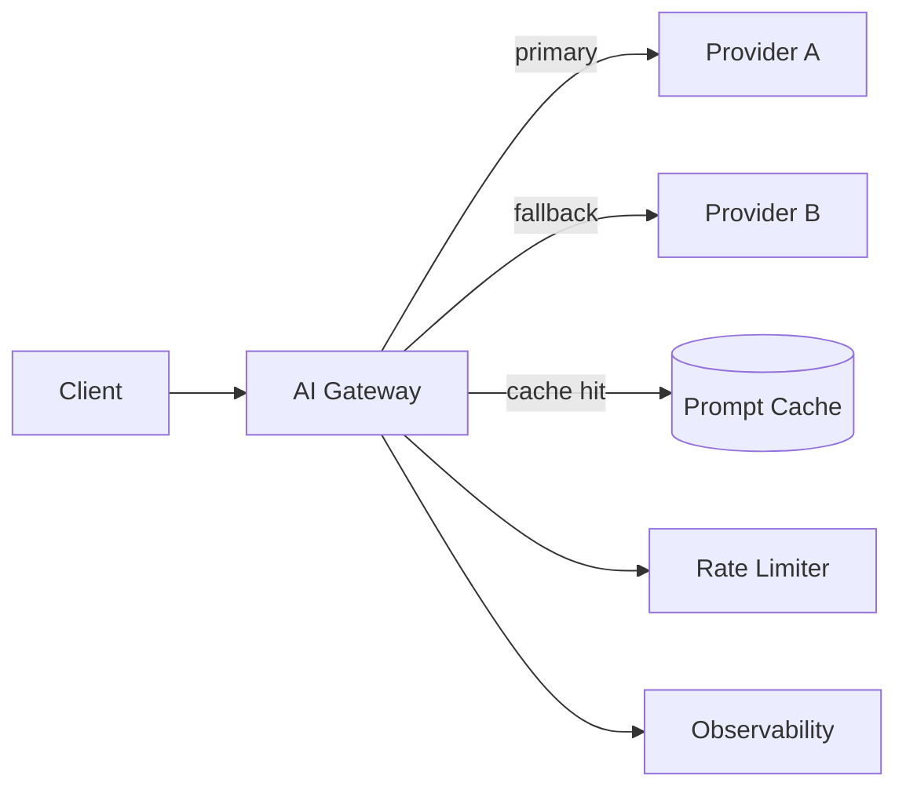

## Diagram

## Summary

A dedicated proxy layer between applications and LLM providers that handles cross-cutting concerns — routing, caching, rate limiting, fallback across providers, cost tracking, and observability — centrally rather than in each application. Structurally analogous to an API Gateway but optimized for the characteristics of LLM calls: high latency, prompt-level caching, token-based cost tracking, and provider-specific failure modes.

## When To Use

- The application calls multiple LLM providers and needs fallback or load balancing between them
- Prompt-level caching can reduce cost and latency for repeated or similar requests
- Cost, latency, and error rate across model calls must be tracked centrally
- Rate limits on the provider must be respected across multiple application instances

## When To Avoid

- The application makes a single type of LLM call to one provider — a gateway adds pure overhead
- LLM call semantics (non-determinism, streaming) complicate caching in ways the gateway cannot handle cleanly

## Pros and Cons

* Good, because provider failures are handled transparently via fallback without application code changes
* Good, because prompt caching, rate limiting, and observability are centralized — no duplication across applications
* Bad, because the gateway is a new component to operate and becomes a critical path dependency for all LLM calls
* Bad, because prompt-level caching requires careful key design — minor prompt variations defeat the cache

## Evolutions

- **From:** Direct LLM provider API calls from each application
- **To:** Combine with Circuit Breaker (open the circuit on a provider that is consistently failing) and Observability (track cost and latency per model and application)
