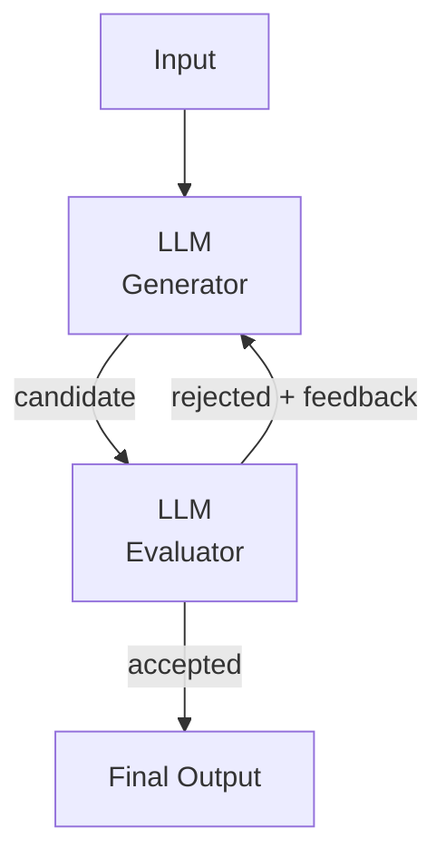

## Diagram

## Summary

Pairs a generator that produces a candidate output with an evaluator that assesses it against criteria and returns actionable feedback. The generator revises based on the critique, and the loop repeats until the evaluator accepts the result or a stop condition is reached. The evaluator may be a separate LLM call, a rubric-driven prompt, or a deterministic check. This mirrors human iterative refinement — draft, critique, revise — and improves quality on tasks where "good" is recognizable but hard to produce in one pass.

## When To Use

- Output quality measurably improves with iterative critique and revision
- Clear evaluation criteria exist that an evaluator can apply consistently (correctness, style, constraints)
- The task tolerates multiple passes in exchange for higher final quality

## When To Avoid

- Quality is adequate on the first pass — the loop adds latency and cost with no gain
- Evaluation criteria are vague or subjective, making the evaluator's feedback unreliable
- The loop cannot be bounded — without a stop condition it risks oscillation or runaway cost

## Pros and Cons

* Good, because iterative critique catches errors and raises quality beyond a single generation pass
* Good, because separating generation from evaluation lets each role use a prompt or model tuned for it
* Bad, because each iteration adds a full generate-plus-evaluate round of latency and token cost
* Bad, because a poorly calibrated evaluator can reject good outputs or loop indefinitely without a stop condition

## Evolutions

- **From:** Single-pass generation with no self-correction
- **To:** Human-in-the-Loop (replace or supplement the automated evaluator with human review for high-stakes output); Agent (embed the critique loop inside an autonomous agent's reasoning cycle)
