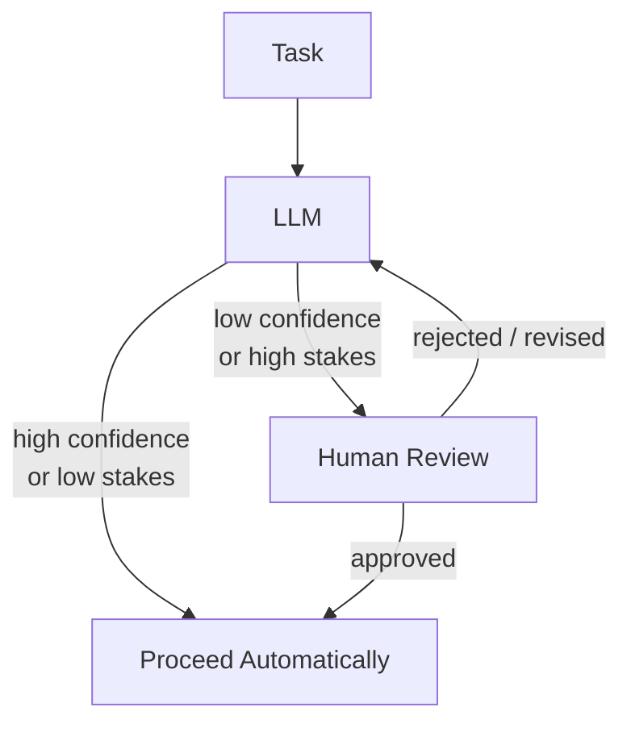

## Diagram

## Summary

Inserts a human review step into an automated LLM workflow at points where the stakes are too high for autonomous action — irreversible operations, low-confidence outputs, regulated decisions, or actions with significant real-world consequences. The LLM handles routine cases automatically; ambiguous or high-risk cases are escalated to a human reviewer before proceeding. This preserves automation efficiency while adding a safety boundary for consequential actions.

## When To Use

- The LLM may take actions that are irreversible (send an email, delete a record, execute a trade)
- Regulatory or compliance requirements mandate human sign-off on certain decision classes
- The model's confidence on a class of inputs is consistently below an acceptable threshold
- Errors in the output have disproportionately high consequences

## When To Avoid

- Human review latency is incompatible with the system's response time requirements
- Human reviewers are not available at the required throughput — bottleneck risk
- The model's reliability on the task is sufficiently high that human review adds cost without meaningful risk reduction

## Pros and Cons

* Good, because irreversible or high-consequence actions require explicit human authorization
* Good, because the review boundary is a natural audit trail for regulated workflows
* Bad, because human review is a throughput bottleneck — the system's capacity is bounded by reviewer availability
* Bad, because routing logic (what triggers escalation) must be carefully calibrated — too sensitive creates alert fatigue, too permissive defeats the purpose

## Evolutions

- **From:** Fully automated agent with no oversight gates
- **To:** Combine with Agent (add HITL checkpoints at specific steps in the agent loop); Multi-Agent (use a supervisor agent to triage which cases need human review)
