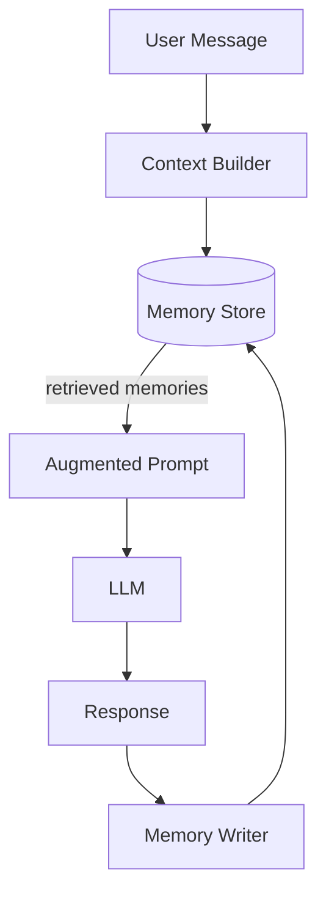

## Diagram

## Summary

Persists information across sessions so the LLM can recall facts, preferences, and prior conversation context beyond what fits in a single context window. Memory is typically tiered: in-context (the current conversation window), external short-term (recent session summaries), and long-term (persistent facts about the user or task). The memory store is queried before generation and updated after, enabling continuity across sessions.

## When To Use

- The application involves ongoing interactions where continuity across sessions is valuable
- User preferences, facts, or prior decisions must influence future responses
- The conversation history exceeds the context window and must be summarized or selectively retrieved

## When To Avoid

- Each session is fully independent and no cross-session context is needed
- The application stores personal data in memory — privacy and retention policies must be considered
- Memory retrieval quality is insufficient to reliably surface the right context — irrelevant memories degrade responses

## Pros and Cons

* Good, because the model can provide personalized, contextually continuous responses across sessions
* Good, because important facts and preferences survive context window limits
* Bad, because stale or incorrect memories can mislead the model — memory must be updatable and deletable
* Bad, because memory stores contain personal data and require explicit privacy, consent, and retention policies

## Evolutions

- **From:** Stateless single-session LLM interactions
- **To:** Combine with RAG (use the memory store as one of multiple retrieval sources); Agent (give the agent explicit read/write memory tools)
