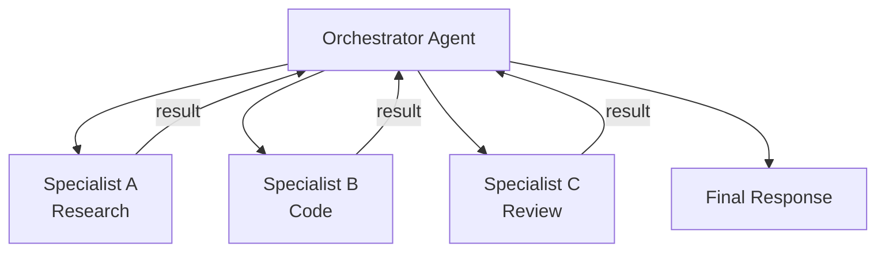

## Diagram

## Summary

Coordinates multiple specialized LLM agents to complete tasks that exceed the capability or context window of a single agent. An orchestrator agent decomposes the task and delegates subtasks to specialist agents optimized for specific capabilities (research, code generation, critique, tool use). Results are collected and synthesized. Agents may run sequentially or in parallel; the topology can be hierarchical (orchestrator/worker) or peer-to-peer (agents communicating directly).

## When To Use

- A task exceeds a single agent's context window or capability set
- Subtasks are independent and can be parallelized across agents
- Specialization improves quality — a dedicated research agent and a dedicated writing agent outperform a generalist
- A critic or review agent is needed to verify another agent's output

## When To Avoid

- The task is simple enough for a single agent — orchestration overhead adds latency and cost
- Agents share state that cannot be cleanly partitioned — coordination complexity can exceed the benefit
- Agent outputs are interdependent in ways that require tight sequential coupling — use Prompt Chaining instead

## Pros and Cons

* Good, because specialized agents perform better on their respective subtasks than a single generalist
* Good, because parallel agent execution reduces total wall-clock time for independent subtasks
* Bad, because inter-agent communication and result synthesis add significant latency and token cost
* Bad, because errors in one agent can propagate and compound across the network — debugging is harder than a single agent

## Evolutions

- **From:** Single agent handling all subtasks sequentially
- **To:** Add Human-in-the-Loop as a supervision layer over the orchestrator for high-stakes multi-agent workflows
