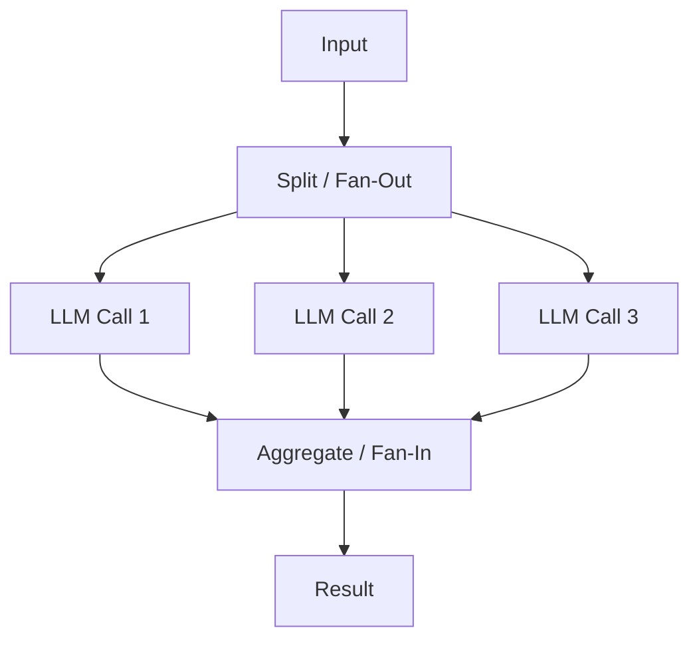

## Diagram

## Summary

Runs multiple LLM calls concurrently and aggregates their outputs. Two variants: **sectioning** splits a task into independent subtasks that run in parallel and are combined (e.g. process each document section at once), and **voting** runs the same task multiple times to gather diverse outputs and select by consensus or threshold (e.g. multiple safety checks, or majority vote on a hard judgment). Parallelization reduces wall-clock latency for independent work and improves reliability by aggregating multiple attempts.

## When To Use

- A task decomposes into independent subtasks that have no ordering dependency (sectioning)
- Multiple diverse attempts improve confidence or coverage on a single hard judgment (voting)
- Latency matters and subtasks can run concurrently rather than sequentially

## When To Avoid

- Subtasks depend on each other's outputs — sequential Prompt Chaining is required instead
- The aggregation step is ill-defined — merging or voting on conflicting outputs is ambiguous
- Fan-out multiplies token cost beyond what the quality or latency gain justifies

## Pros and Cons

* Good, because independent subtasks complete in parallel, cutting total wall-clock latency
* Good, because voting across multiple attempts raises reliability on hard or high-stakes judgments
* Bad, because concurrent calls multiply token cost linearly with the fan-out width
* Bad, because aggregating divergent or conflicting outputs requires a well-designed merge or voting strategy

## Evolutions

- **From:** Sequential single-threaded LLM calls processing subtasks one at a time
- **To:** Multi-Agent (assign parallel branches to specialized autonomous agents); Evaluator-Optimizer (feed multiple candidates into an evaluator to select the best)
