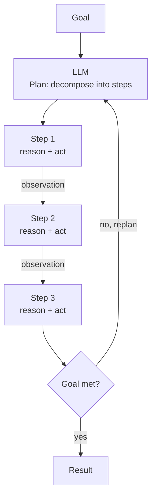

## Diagram

## Summary

Has the model produce an explicit plan — a decomposition of a goal into ordered steps — then execute those steps, interleaving reasoning with action and observation (the ReAct loop). Unlike a fixed Prompt Chain, the plan is generated dynamically from the goal and can be revised mid-execution as observations arrive. Planning gives an agent structure for multi-step tasks whose steps cannot be predetermined, while keeping the reasoning trace inspectable.

## When To Use

- A task requires multiple steps whose sequence cannot be hardcoded in advance
- The model benefits from committing to an explicit plan before acting, improving coherence over ad-hoc steps
- Intermediate observations (tool results, retrieved data) should inform and revise subsequent steps

## When To Avoid

- The step sequence is known and fixed — a deterministic Prompt Chain is simpler and more reliable
- The task is a single reasoning step with no branching or tool interaction
- Tight latency budgets cannot absorb the overhead of explicit planning plus per-step reasoning

## Pros and Cons

* Good, because an explicit plan improves coherence and gives an inspectable reasoning trace for multi-step tasks
* Good, because interleaving reasoning with observations lets the agent adapt the plan to what it learns
* Bad, because a flawed initial plan propagates errors through every downstream step
* Bad, because dynamic planning and replanning add LLM calls, latency, and non-deterministic control flow that is harder to test

## Evolutions

- **From:** Prompt Chaining with a fixed, predetermined sequence of steps
- **To:** Agent (wrap planning in a fully autonomous loop with tool use and memory); Multi-Agent (delegate planned subtasks to specialist agents)
