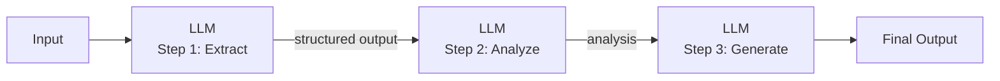

## Diagram

## Summary

Decomposes a complex task into a sequence of simpler LLM calls, where each call processes the output of the previous one. Each step has a narrowly scoped prompt optimized for that subtask — extraction, classification, transformation, generation — rather than asking a single prompt to do everything. Chaining improves reliability on complex tasks and allows intermediate outputs to be validated or transformed between steps.

## When To Use

- A task is too complex for reliable single-prompt completion
- Different steps in the pipeline benefit from different prompt strategies or models
- Intermediate outputs need to be validated, filtered, or transformed before being passed to the next step

## When To Avoid

- The task is simple enough for a single prompt — chaining adds latency and cost without benefit
- Steps are not independent — if each step's logic depends on branching decisions, use Agent instead
- Latency budget cannot accommodate multiple sequential LLM calls

## Pros and Cons

* Good, because each step is simpler and more reliable than a single complex prompt attempting the full task
* Good, because intermediate outputs are inspectable and can be validated between steps
* Bad, because errors in early steps propagate and compound through the chain
* Bad, because total latency is the sum of all step latencies — chains with many steps are slow

## Evolutions

- **From:** Single monolithic prompt attempting the full task
- **To:** Agent (add dynamic branching and tool use when the chain's steps cannot be predetermined); Parallel execution (run independent chain branches concurrently via Multi-Agent)
