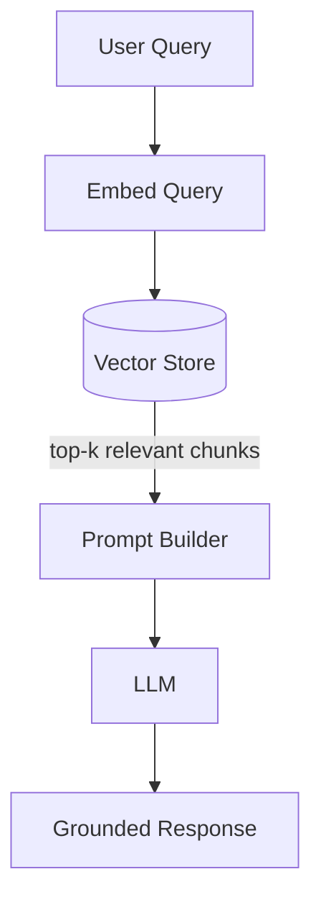

## Diagram

## Summary

Augments an LLM's generation with documents retrieved at query time from an external knowledge store. The user's query is embedded and used to retrieve the most semantically relevant chunks from a vector store; those chunks are injected into the prompt as context before generation. RAG grounds responses in current, domain-specific data without retraining the model — addressing the LLM's knowledge cutoff and hallucination problems for factual queries.

## When To Use

- Responses must be grounded in a specific knowledge base that changes frequently or is too large to fit in a prompt
- The model must answer questions about documents, data, or facts it was not trained on
- Hallucination on factual queries is unacceptable and must be reduced by providing source material

## When To Avoid

- The knowledge base is small enough to fit directly in a prompt (just include it)
- The query requires reasoning over the full knowledge base rather than retrieving relevant fragments
- Response latency cannot accommodate an extra retrieval round trip

## Pros and Cons

* Good, because responses are grounded in retrieved source material — hallucination on covered topics is reduced
* Good, because the knowledge base can be updated without retraining the model
* Bad, because retrieval quality determines answer quality — poor embeddings or chunking strategies surface the wrong context
* Bad, because adding a retrieval step increases latency and introduces a dependency on the vector store

## Evolutions

- **From:** Direct LLM prompting with no external grounding
- **To:** Agent (add tools and multi-step reasoning around RAG retrieval); Memory (persist retrieved or generated content across sessions)
