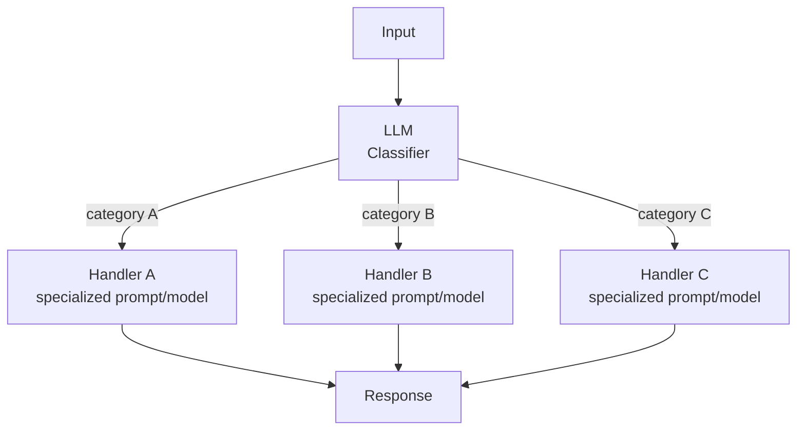

## Diagram

## Summary

Classifies an input and directs it to a specialized downstream handler — a dedicated prompt, model, or workflow tuned for that category. A first LLM (or a cheaper classifier) determines the input's type, then routing sends it to the path best suited to handle it. This separates concerns cleanly: each handler is optimized for one kind of request rather than one prompt attempting to cover every case, and inputs can be routed to cheaper or more capable models by difficulty.

## When To Use

- Inputs fall into distinct categories that are better served by different prompts, models, or tools
- Optimizing one path would degrade another if they shared a single prompt
- Cost or latency can be reduced by routing easy cases to smaller models and hard cases to larger ones

## When To Avoid

- Inputs are homogeneous — a single prompt handles all cases well and routing adds needless indirection
- Categories cannot be reliably distinguished — misclassification sends inputs down the wrong path and degrades quality
- The classification step's added latency and cost outweigh the benefit of specialization

## Pros and Cons

* Good, because each handler is optimized for one category, improving quality over a single catch-all prompt
* Good, because inputs can be routed to cost- and latency-appropriate models by difficulty
* Bad, because misclassification silently sends inputs to the wrong handler, and errors are hard to attribute
* Bad, because the classifier is an added LLM call that adds latency and cost to every request

## Evolutions

- **From:** A single prompt attempting to handle every category of input
- **To:** Prompt Chaining (specialize each routed path into a multi-step pipeline); Multi-Agent (route to autonomous specialist agents rather than static handlers)
