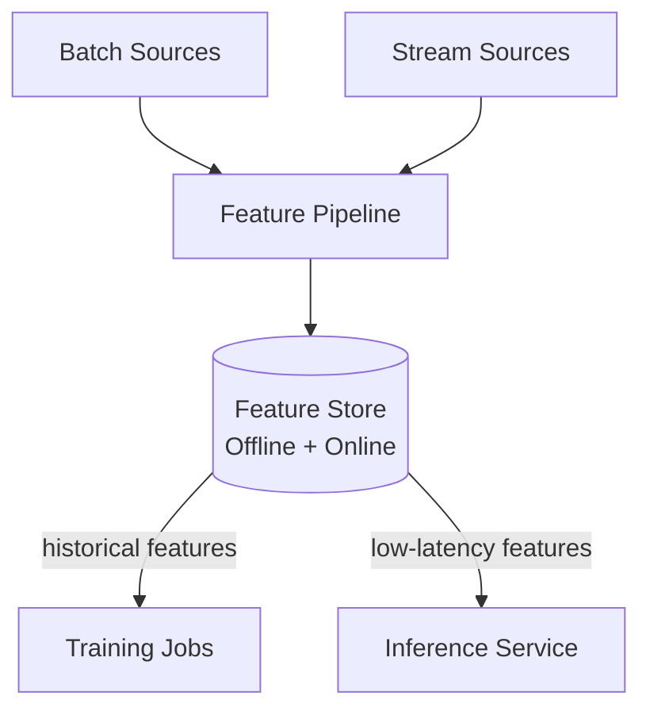

## Diagram

## Summary

A centralized system for computing, storing, and serving machine learning features consistently across training and inference. Features are defined once and reused by multiple models; the store provides historical features for training (offline store) and low-latency features for real-time inference (online store). Training-serving skew — where features computed differently at training vs. inference time cause silent model degradation — is the primary problem this pattern solves.

## When To Use

- Multiple models share the same features and recomputing them independently creates duplication and inconsistency
- Training-serving skew is causing model performance degradation in production
- Feature computation involves expensive joins or aggregations that should not be repeated per model

## When To Avoid

- A single model with simple features that are not shared — the overhead of a feature store is not justified
- All features are already computed in a shared data pipeline and consistency is maintained by other means

## Pros and Cons

* Good, because features computed once are guaranteed to be consistent between training and inference
* Good, because feature reuse across teams and models reduces duplicated engineering effort
* Bad, because maintaining two storage tiers (offline historical, online low-latency) is operationally complex
* Bad, because the feature store becomes a critical path dependency for both training and inference

## Evolutions

- **From:** Per-model feature computation duplicated across training pipelines and serving code
- **To:** Integrate with Training Pipeline (supply historical features) and Model Serving (supply real-time features at inference)
