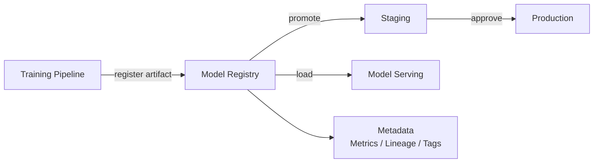

## Diagram

## Summary

A versioned catalog of trained model artifacts along with their metadata — training metrics, data lineage, hyperparameters, and deployment history. Models are registered after training, promoted through environments (staging → production) via explicit approval gates, and loaded by the serving layer by version identifier. The registry provides the governance layer between training and serving: no model reaches production without being registered and promoted.

## When To Use

- Multiple model versions must be tracked and compared before promotion to production
- Rollback to a prior model version must be possible without retraining
- Audit trails of what model was serving, when, and why are required for compliance or debugging

## When To Avoid

- A single model is trained once and never updated — a versioned store adds overhead with no benefit
- The organization has no approval process for model promotion — consider whether one is needed before adding the infrastructure

## Pros and Cons

* Good, because every promoted model has a complete audit trail of its training data, metrics, and approvals
* Good, because rollback is a registry lookup and serving update — no retraining required
* Bad, because the registry adds a governance step that slows the path from training to production
* Bad, because stale model versions accumulate and require active lifecycle management and cleanup

## Evolutions

- **From:** Model artifacts stored as files with no versioning or promotion process
- **To:** Integrate with Training Pipeline (auto-register successful runs); connect to Model Serving (load promoted versions by ID); trigger automated retraining and re-registration when data drift is detected
