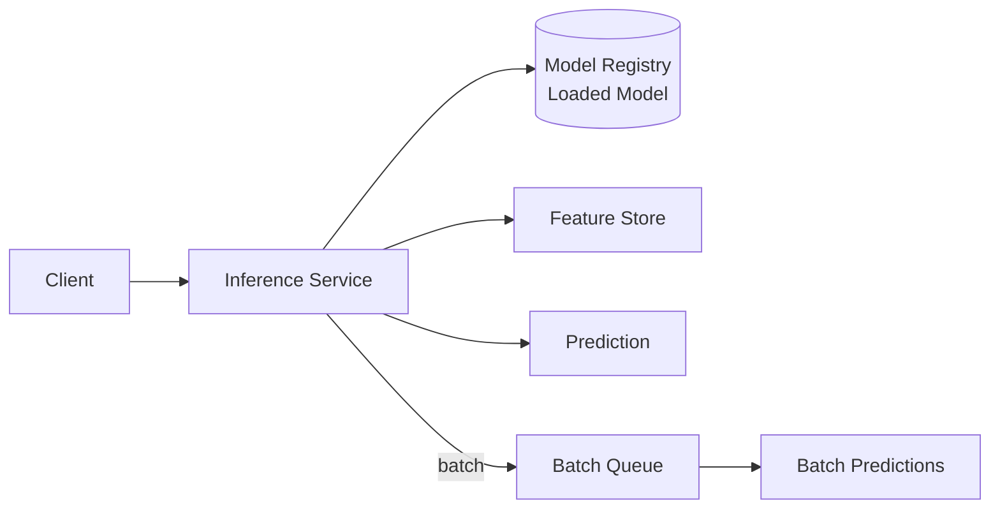

## Diagram

## Summary

Infrastructure that loads a trained model and exposes it for inference — either online (synchronous, low-latency predictions per request) or batch (asynchronous bulk predictions over a dataset). The serving layer handles model loading and versioning, feature retrieval, input validation, prediction computation, and output formatting. Multiple model versions can be served simultaneously to support Canary Release patterns for gradual model promotion.

## When To Use

- A trained model must be available for prediction requests in production
- Different clients or use cases require online (real-time) vs. batch (bulk) prediction modes
- Multiple model versions must coexist to support A/B testing or gradual rollout

## When To Avoid

- Predictions are computed offline and stored — serving infrastructure is not needed if consumers read from a precomputed store
- The model is simple enough to embed directly in the application without a dedicated serving layer

## Pros and Cons

* Good, because model loading, versioning, and scaling are separated from application logic
* Good, because multiple model versions can be served concurrently for safe promotion
* Bad, because the serving layer adds latency, infrastructure cost, and a network boundary to every prediction
* Bad, because model and feature pipeline changes must be coordinated to avoid serving stale or incompatible inputs

## Evolutions

- **From:** Model embedded directly in the application or loaded from a file path
- **To:** Connect to Model Registry (promote new versions through staging and production); apply Canary Release to gradually shift traffic to a new model version; use Feature Store for consistent real-time feature retrieval
