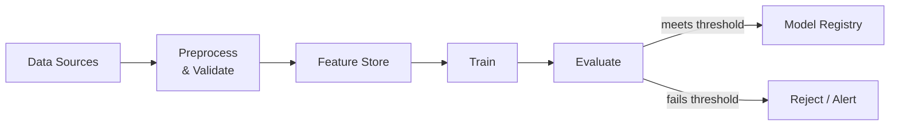

## Diagram

## Summary

An orchestrated, reproducible sequence of steps that transforms raw data into a trained, evaluated model artifact. Stages typically include data ingestion, preprocessing and validation, feature computation, model training, and evaluation against a quality threshold. The pipeline is triggered on schedule or by data changes; successful runs produce a versioned model artifact registered in the Model Registry. Automation and reproducibility are the central goals — the same inputs must always produce equivalent outputs.

## When To Use

- Models must be retrained regularly as training data evolves
- Reproducibility is required — the same data and hyperparameters must produce the same model
- Training steps must be auditable for compliance or debugging

## When To Avoid

- The model is trained once and never retrained (use a notebook and deploy the artifact directly)
- Training is too experimental and rapid to justify pipeline infrastructure — move to a pipeline when the process stabilizes

## Pros and Cons

* Good, because training is automated, reproducible, and auditable end-to-end
* Good, because quality gates prevent bad models from reaching the registry
* Bad, because pipeline infrastructure adds engineering overhead before any model improvement is delivered
* Bad, because long pipeline runtimes slow iteration — caching intermediate stages is important but complex

## Evolutions

- **From:** Manual, ad-hoc notebook-based training runs
- **To:** Add Feature Store (centralize feature computation shared across pipelines); connect to Model Registry (promote artifacts through environments); trigger automated retraining on data drift
