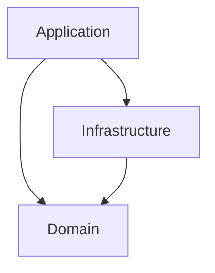

## Diagram

## Summary
Organizes code around the business domain rather than technical concerns, using bounded contexts to separate distinct areas of the model and a ubiquitous language shared between developers and domain experts. Core building blocks — aggregates, entities, value objects, domain events, and repositories — keep business invariants explicit and co-located with the code that enforces them. DDD is both a strategic design approach (how to carve up a large domain) and a tactical set of patterns (how to model objects within a bounded context).

## When To Use
- The domain is complex with rich business rules that change frequently
- Close collaboration with domain experts is possible and sustained
- The team needs to guard consistency boundaries (aggregates) without a relational schema doing that work
- The system will grow large enough that bounded context separation prevents model corruption across teams

## When To Avoid
- The application is primarily CRUD with little domain logic — Three-Tier or Transaction Script is simpler
- Domain experts are unavailable or unwilling to engage in collaborative modelling sessions
- The team is unfamiliar with DDD tactical patterns — the learning curve produces complexity before benefit
- Time-to-market pressure makes the upfront modelling investment unjustifiable

## Pros and Cons

* Good, because the ubiquitous language reduces the translation tax between requirements and code
* Good, because aggregates enforce consistency boundaries explicitly, preventing invariant violations
* Good, because bounded contexts allow large teams to evolve independent models without interference
* Good, because domain events make side effects explicit and enable decoupled downstream reactions
* Bad, because the upfront investment in domain modelling is significant and requires experienced practitioners
* Bad, because tactical patterns (aggregate design, repository abstraction) add boilerplate to simple CRUD scenarios
* Bad, because bounded context integration patterns (Anti-Corruption Layer, Shared Kernel) add complexity when multiple contexts must collaborate

## Evolutions
- **From:** Three-Tier or Layered Monolith (enrich the domain layer with explicit aggregates and bounded contexts)
- **To:** Microservices (deploy each bounded context as an independent service), Event Sourcing (persist domain events as the record of truth), CQRS (separate read and write models within a bounded context)
