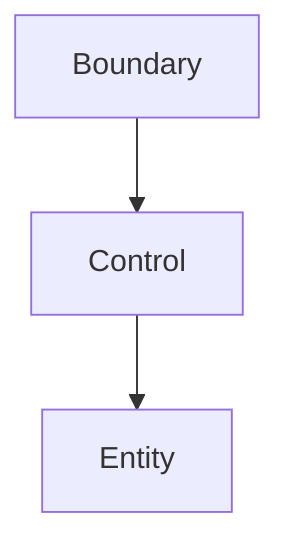

## Diagram

## Summary
Organizes objects into three distinct stereotypical roles: Entity (persistent domain data and its invariants), Control (use-case coordination logic that orchestrates entities and boundaries), and Boundary (interface objects that mediate between external actors and the system interior). Originally introduced by Ivar Jacobson in the context of use-case-driven design. The three roles map cleanly onto use cases: each use case has a dedicated Control object that drives the necessary Entities through one or more Boundary interfaces.

## When To Use
- The design is use-case-driven and every use case should be traceable to a discrete coordination object
- Building enterprise or embedded systems where explicit role stereotypes improve team communication
- Domain-expert collaboration centers on use-case walkthrough rather than aggregate modelling
- The team wants a structural guideline that is lighter weight than full DDD tactical patterns

## When To Avoid
- The system is CRUD-heavy and use cases are trivially thin — the three-role split adds boilerplate without value
- Full Domain-Driven Design is already adopted — DDD aggregates and application services supersede ECB roles
- The team is unfamiliar with the pattern — without discipline, Control objects collapse into service-layer god classes

## Pros and Cons

* Good, because each use case is encapsulated in a named Control object, making requirements-to-code traceability direct
* Good, because Boundary objects isolate the system from external change (protocol changes, UI changes) without touching domain logic
* Good, because Entity objects remain free of use-case logic, keeping persistent data and invariants clean
* Bad, because fine-grained Control objects can proliferate, creating many thin classes with little shared logic
* Bad, because the pattern provides roles but not rules for internal complexity — Control objects can become large orchestrators
* Bad, because without tooling, the three stereotypes are enforced only by naming convention and code review

## Evolutions
- **From:** Unstructured or Layered Monolith (introduce ECB roles to give objects explicit responsibilities within a use-case model)
- **To:** Domain-Driven Design (replace Entity/Control with Aggregates/Application Services for richer invariant enforcement), Hexagonal Architecture (Boundary becomes a formal Port/Adapter abstraction)
