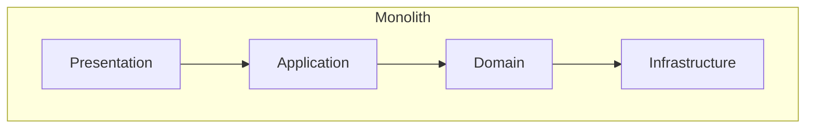

## Diagram

## Summary
A single-deployable application that enforces strict horizontal layer boundaries internally: typically Presentation, Application, Domain, and Infrastructure. All layers compile and deploy as one unit, but dependencies flow only downward (or inward, in hexagonal variants). The Layered Monolith is the most common starting point for greenfield applications and remains appropriate whenever independent deployment of components is not required.

## When To Use
- The team is small enough to share a single codebase and deployment pipeline
- The domain does not require the operational complexity of distributed services
- Clear separation of presentation, business logic, and persistence is desired without the overhead of network boundaries
- A simple operational model (single process, single database) is sufficient for the expected load

## When To Avoid
- Different parts of the system need to scale or be deployed independently
- Multiple teams require autonomous ownership of distinct capabilities
- Deployment of one module must not risk other modules
- The application has grown to the point where a single codebase is a coordination bottleneck

## Pros and Cons

* Good, because a single deployment unit is simple to operate, debug, and reason about end-to-end
* Good, because in-process calls between layers are fast and do not require network serialization
* Good, because refactoring across layers is straightforward — all code is visible in one place
* Bad, because scaling requires replicating the entire application, even when only one layer is the bottleneck
* Bad, because a bug or bad deployment in any layer takes down the entire application
* Bad, because layer boundaries enforced only by convention erode over time without tooling or strict code review

## Evolutions
- **From:** Unstructured Monolith (add explicit layer boundaries to an existing single-deployable)
- **To:** Modular Monolith (add enforced module boundaries within the same deployment unit), Microservices (extract layers or modules into independently deployable services), Three-Tier (simplify to three canonical tiers for CRUD-heavy applications)
