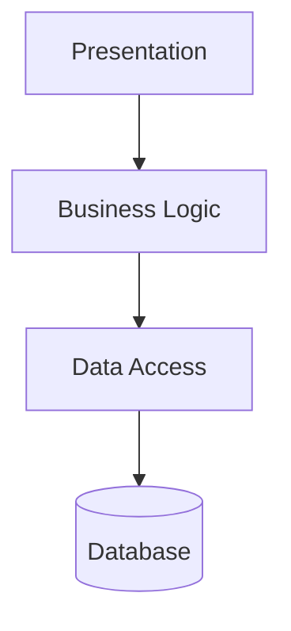

## Diagram

## Summary
Structures an application into three horizontal layers: Presentation (UI), Business Logic (application/domain), and Data Access (persistence). Each layer may only communicate with the layer directly below it. The most common structure for web applications and CRUD-oriented services.

## When To Use
- Building a standard web application or CRUD-oriented service
- Team wants clear separation between UI, logic, and persistence concerns
- Different specialists (frontend, backend, DBA) own different tiers
- The application will be deployed as a single unit but needs internal structure

## When To Avoid
- Business logic is trivially thin — a Transaction Script suffices without the layering overhead
- Strict layering creates excessive abstraction with no real benefit
- The domain is complex enough to warrant DDD's richer internal structure
- Performance requirements make the additional abstraction layer unacceptable

## Pros and Cons

* Good, because separation of concerns makes each layer independently testable
* Good, because familiar to most developers — minimal onboarding required
* Good, because each layer can be replaced (swap the DB, swap the UI) without touching others
* Bad, because changes frequently ripple through all three layers (shotgun surgery)
* Bad, because can produce an anemic domain model — logic drifts into presentation or data layers
* Bad, because strict layering discourages the rich domain model that complex domains require

## Evolutions
- **From:** Monolith or Layered Monolith (Three-Tier formalizes layer separation)
- **To:** Domain-Driven Design (enrich the business layer), Distributed Tiers (split tiers across network boundaries), Microservices (decompose services along domain lines)
