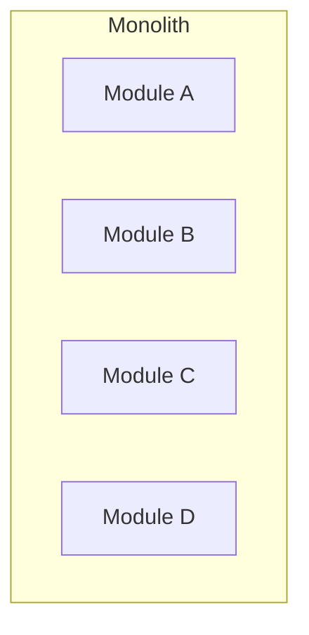

## Diagram

## Summary
A single deployable unit with no architectural boundaries enforced between components. All modules run in-process, sharing memory directly. The default starting point for most software — complexity is added only when justified.

## When To Use
- Team is small (1–5 engineers) and coordination overhead outweighs deployment flexibility
- The system is early-stage or a prototype where rapid iteration is the priority
- Ultra-low latency is required — in-process calls eliminate serialization and network overhead
- The domain is not yet well understood and module boundaries are likely to shift

## When To Avoid
- Multiple teams need to develop and release components independently
- Different subsystems have significantly different scaling characteristics
- A fault in one component must not bring down the whole system
- Different parts of the system require different technology stacks or release cadences

## Pros and Cons

* Good, because development, testing, and debugging require no distributed systems knowledge
* Good, because in-process calls eliminate network latency and serialization overhead
* Good, because all code is co-located — refactoring and boundary changes are cheap
* Good, because a single deployment unit simplifies CI/CD and operations
* Bad, because scaling requires replicating the entire application, not just the bottleneck
* Bad, because a single fault can bring down the entire system
* Bad, because large teams experience merge conflicts and build-time contention
* Bad, because technology choices (language, framework, runtime) are locked in globally

## Evolutions
- **From:** No predecessor — Monolith is the default starting point
- **To:** Layers (add internal structure), Modular Monolith (enforce module boundaries), Services (extract independently deployable units), Shards (horizontally replicate for scale)
