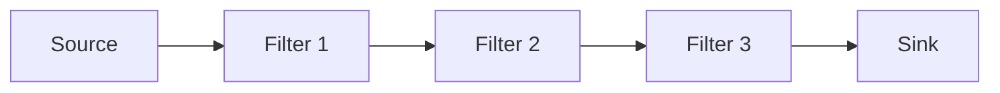

## Diagram

## Summary
A system topology where data flows through a chain of processors — one component per step of data transformation. The guiding principle: "Never return. Push your data through a chain of processors." Each filter receives input, transforms it, and passes it downstream without returning control to the caller. Steps can be swapped, reordered, or scaled independently, making the pattern well-suited to experimental algorithms and configurable processing chains. Complexity grows quickly when conditional branching or a large number of use cases are introduced.

## When To Use
- Processing steps are experimental and need to be tested individually before being connected
- Components must be reusable across different processing configurations or customer variants
- Steps are stateless and can be distributed or scaled independently
- The system performs a well-defined linear data transformation with a stable, small set of scenarios

## When To Avoid
- The number of distinct use cases or scenarios is large — the interaction surface between components becomes unmanageable
- Use cases involve complex conditional logic requiring multiple branching pipelines
- Low latency is required — serialization delays and scheduling overhead accumulate at each step

## Pros and Cons

* Good, because steps can be added, replaced, or reordered without changing other components
* Good, because each step can be developed, tested, and scaled independently
* Good, because stateless filter components are reusable across different pipeline configurations
* Good, because multiple teams and technology stacks can own different stages
* Bad, because the architecture degrades as the number of scenarios and conditional paths grows
* Bad, because sequential inter-component calls produce poor end-to-end latency
* Bad, because communication overhead (serialization, scheduling) accumulates at every step
* Bad, because error handling across a chain of asynchronous steps is non-trivial

## Evolutions
- **From:** Services (Pipeline is a specialization where inter-service calls are strictly sequential and unidirectional)
- **To:** Promote the first filter to a Front Controller that tracks request state across the chain; add an Orchestrator to convert the Pipeline into standard Services, moving business logic out of the filters and eliminating direct inter-filter communication
