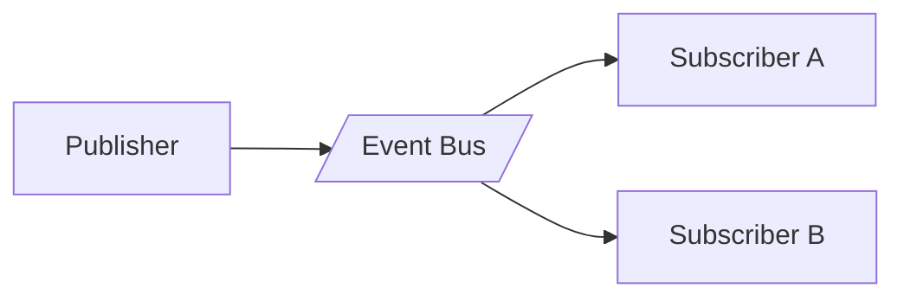

## Diagram

## Summary
Components communicate by producing and consuming events through a broker, with no direct dependencies between producers and consumers. Producers emit events without knowledge of who handles them; consumers subscribe to events of interest and react independently.

## When To Use
- Components must evolve independently with no compile-time or deployment coupling
- The system must fan out a single event to multiple independent consumers
- Workflows span multiple services where tight coupling would create fragility
- Audit trails or replay of past events are required

## When To Avoid
- Simple request/response semantics are sufficient — async adds unnecessary complexity
- Strong consistency or synchronous confirmation is required by the caller
- The team lacks experience with eventual consistency and async distributed debugging
- Event schema management overhead is not justified by the domain complexity

## Pros and Cons

* Good, because producers and consumers are fully decoupled — either side changes without the other
* Good, because new consumers are added without modifying producers
* Good, because the broker buffers traffic — consumers process at their own pace
* Bad, because tracing a request across multiple async hops is significantly harder than synchronous calls
* Bad, because eventual consistency requires explicit handling of out-of-order and duplicate events
* Bad, because event schema evolution must be coordinated to avoid breaking consumers

## Evolutions
- **From:** Pipeline (EDA is a choreographed variant of the Pipeline metapattern)
- **To:** Event Sourcing (persist all events as the system of record), Persistent Event Log (add durability and replay), Data Mesh (apply EDA principles to data products)
