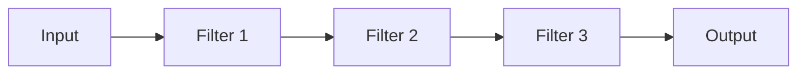

## Diagram

## Summary
Processing logic is decomposed into a sequence of independent filter stages, each performing a single transformation on its input and passing the result downstream via a pipe. Filters are unaware of upstream or downstream stages and communicate only through the pipe interface. This composability allows pipelines to be assembled from reusable filters, reordered, branched, and tested in isolation. The pattern is foundational in Unix shell pipelines, compiler passes, ETL frameworks, and HTTP middleware chains.

## When To Use
- Processing can be decomposed into a sequence of clearly separable, independently testable transformations
- Filters are reusable across different pipeline configurations or products
- Adding, removing, or reordering processing stages must be possible without modifying existing filters
- The pipeline must be transparently observable — inserting a logging or metrics filter between stages is a common requirement

## When To Avoid
- Filters need shared state or must communicate out-of-band — the pipes-only interface breaks down and requires a different coordination pattern
- Performance is critical and per-stage serialization/deserialization overhead between filters is unacceptable
- The processing is inherently stateful with complex branching that cannot be expressed as a linear sequence of transforms

## Pros and Cons

* Good, because filters are independently testable — each stage can be unit-tested with synthetic input without the full pipeline
* Good, because pipelines are composable and reconfigurable — stages can be added, removed, or reordered without touching existing code
* Good, because concerns are cleanly separated — each filter has a single, well-defined responsibility
* Bad, because naive implementations pass full data copies between stages, causing memory and CPU overhead at each pipe boundary
* Bad, because error handling and partial failure recovery across a chain of filters requires explicit protocol design
* Bad, because deeply sequential pipelines with many fine-grained stages can be hard to trace and debug end-to-end

## Evolutions
- **From:** Monolithic processing routines (decompose a single large processing function into discrete, composable filter stages)
- **To:** Stream Processing (make the pipeline continuous and stateful over unbounded data), Workflow System (add durable execution, human steps, and non-linear branching to a processing pipeline)
