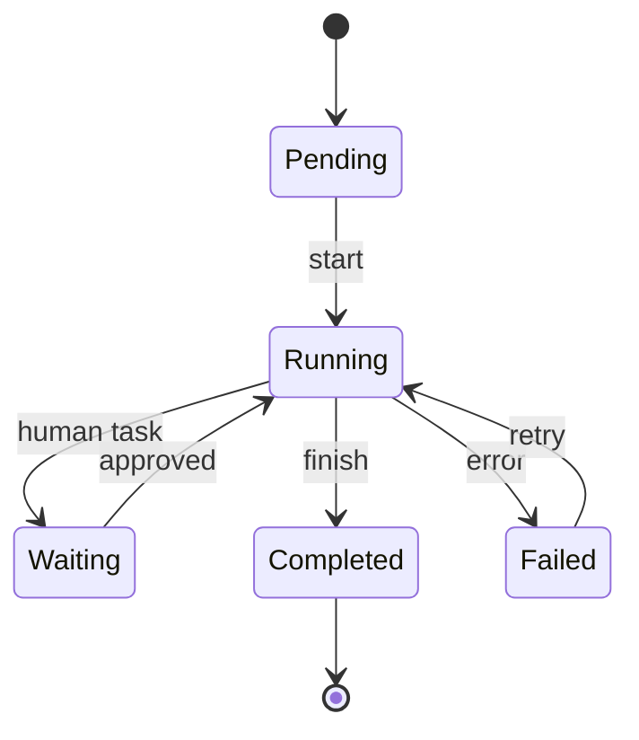

## Diagram

## Summary
Long-running, multi-step business processes are modeled as explicit, persisted workflows. Each step may involve automated service calls, human tasks, approvals, timers, and conditional branching. The workflow engine persists state between steps, handles retries and timeouts, and resumes execution after failures or prolonged waits — potentially spanning hours, days, or months. Workflow definitions are first-class artifacts that make business process logic visible and auditable independently of the services that execute individual steps.

## When To Use
- Business processes span multiple services or human participants and must survive system restarts and failures
- Human approval, review, or data-entry steps are part of the process and may block for extended, unpredictable durations
- Process logic involves complex conditional branching, parallel execution, and compensation (rollback on failure) that would be difficult to encode in ad-hoc service calls
- Regulatory or audit requirements demand a complete, tamper-evident record of every step taken in a process

## When To Avoid
- The process is short-lived (milliseconds to seconds) and can be handled synchronously in a single request — durable execution overhead is unjustified
- The team lacks a workflow engine or the engineering effort to deploy and operate one exceeds the benefit
- Process logic is simple and linear with no human steps — a pipes-and-filters or batch job is sufficient

## Pros and Cons

* Good, because workflow state is persisted — processes survive crashes, deployments, and infrastructure failures without data loss
* Good, because process logic is explicit and centralized — the workflow definition documents the business process in an auditable, inspectable form
* Good, because built-in retry, timeout, and compensation mechanisms reduce the boilerplate of error handling across distributed steps
* Bad, because introducing a workflow engine adds a stateful, long-running infrastructure component that requires operational expertise
* Bad, because tightly coupling business process logic to a specific workflow engine can create vendor lock-in or migration risk
* Bad, because long-running workflows holding locks or reservations across services can impede throughput and complicate concurrent process execution

## Evolutions
- **From:** Ad-hoc service orchestration or Saga implementations (replace hand-rolled state machines with a durable workflow engine)
- **To:** Event-Driven Architecture (externalize workflow state transitions as domain events for broader observability), Saga (use compensating transactions within a workflow for distributed consistency without two-phase commit)
