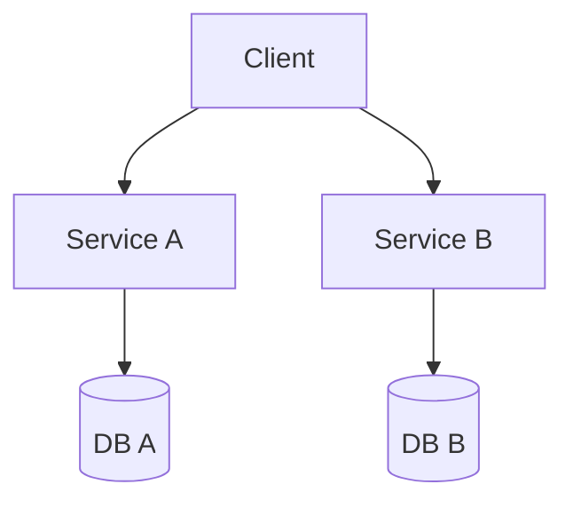

## Diagram

## Summary
Divides a large codebase into independently deployable components, one per subdomain. Each service is owned by a dedicated team, can use its own technology stack, and scales independently. The guiding principle is "Divide and conquer — gain flexibility through decoupling subdomains." The pattern is well-suited to large organizations but introduces significant distributed-systems complexity: global use cases become hard to trace, latency increases at service boundaries, and changing the domain structure after the fact is nearly impossible.

## When To Use
- The project exceeds ~1,000,000 lines of code and requires multiple independent teams
- Teams need to own and release their subdomain components without coordinating with other teams
- Different subdomains have distinct scaling requirements (some services face much higher load)
- Subdomains have sufficiently varied technical requirements to justify different technology stacks

## When To Avoid
- The domain is highly cohesive and everything depends on everything — service boundaries will be artificial and costly
- The domain is not yet well understood — misaligned service interfaces will be expensive to fix later
- The project needs a fast start — designing service interfaces up front is a significant investment
- Low-latency or real-time reaction requirements make inter-service network calls unacceptable

## Pros and Cons

* Good, because large codebases can be developed by multiple independent teams simultaneously
* Good, because each service can use the most appropriate technology stack for its subdomain
* Good, because services scale independently, directing resources only to bottlenecks
* Good, because service boundaries enforce team ownership and reduce coupling
* Bad, because global use cases that span multiple services are hard to debug and trace
* Bad, because inter-service calls introduce latency that cannot be eliminated
* Bad, because sharing state between services has no clean solution
* Bad, because operational complexity (deployment, networking, observability) multiplies with service count
* Bad, because restructuring domain boundaries after services are established is extremely costly

## Evolutions
- **From:** Monolith or Layers (when scale or team size outgrows a single codebase)
- **To:** Split oversized services; merge strongly coupled ones; add Middleware, Sidecars, Shared Database, Proxies, or Orchestrators; apply Layers or Hexagonal Architecture within individual services; group coupled services into Cells; apply Shards to individual services under high load
