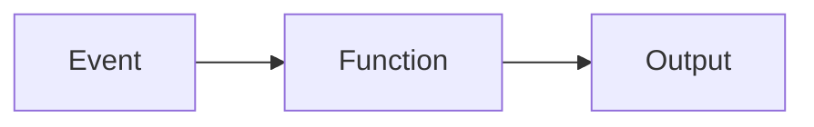

## Diagram

## Summary
Each discrete unit of business logic is packaged as a stateless function deployed and billed independently. The cloud platform manages provisioning, scaling from zero to thousands of concurrent executions, and deprovisioning — there are no persistent server processes to manage. Functions are triggered by HTTP requests, queue messages, scheduled events, or storage changes, and must complete within a platform-imposed execution time limit.

## When To Use
- Workloads are bursty or unpredictable — scale-to-zero eliminates idle resource cost
- Each unit of logic is genuinely independent and short-lived (request/response or event handler)
- Operational simplicity is a priority — no servers, no patching, no capacity planning
- Pay-per-invocation billing aligns cost directly to usage

## When To Avoid
- Functions require warm, low-latency startup — cold starts introduce unpredictable tail latency
- Business logic involves long-running stateful workflows that exceed platform execution time limits
- The application requires persistent in-memory state or long-lived connections (WebSockets, streaming)
- Vendor lock-in to a specific cloud provider's execution model is not acceptable

## Pros and Cons

* Good, because the platform auto-scales to any concurrency level without operator intervention
* Good, because scale-to-zero eliminates cost during idle periods
* Good, because no server management overhead — patching, capacity planning, and runtime updates are the provider's responsibility
* Bad, because cold-start latency degrades response time for infrequently invoked functions
* Bad, because stateless execution makes session and workflow state management the developer's explicit responsibility
* Bad, because local development, integration testing, and observability tooling for function-heavy systems lag behind traditional services

## Evolutions
- **From:** Microservices (decompose individual handlers into independently deployed functions when operational simplicity outweighs cold-start cost)
- **To:** Workflow System (chain functions with durable execution for long-running processes), Actors (add persistent state and message-driven coordination between functions)
