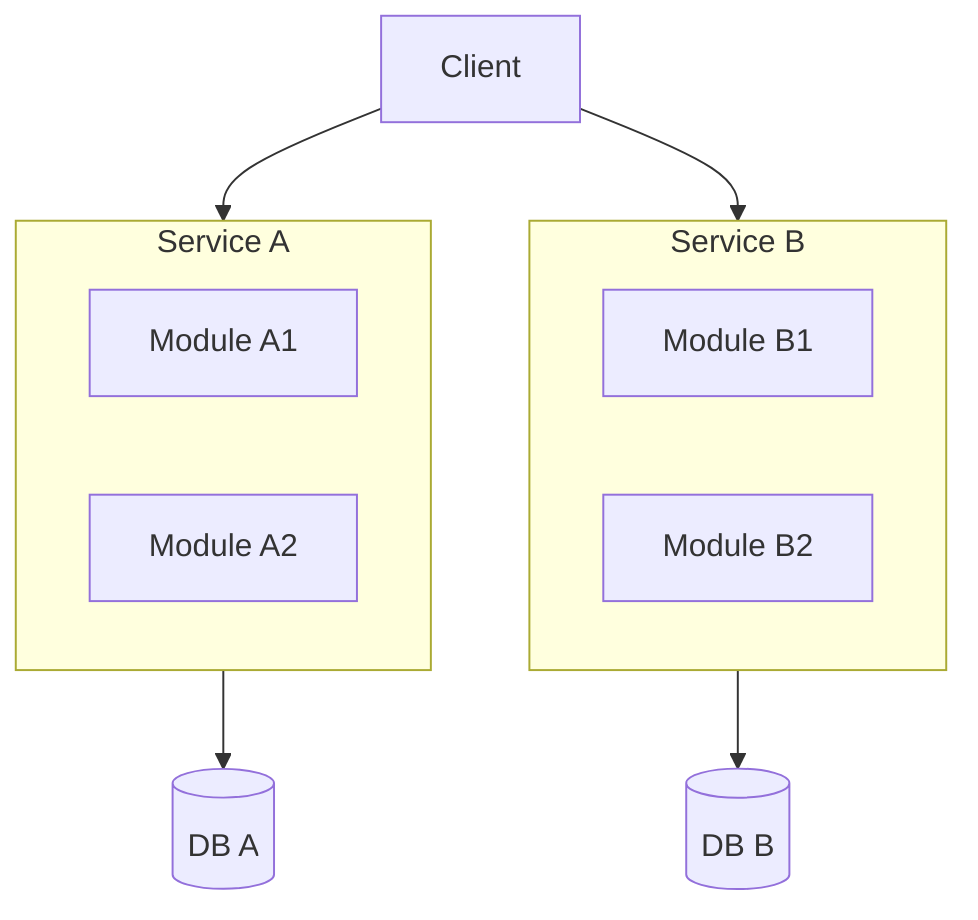

## Diagram

## Summary
Decomposes the system into two to five large services aligned to major business domains, each owning its data store and deployed independently. Macroservices are coarser than microservices — each service may contain multiple logical modules — but finer than a monolith. The approach trades the fine-grained independent scalability of microservices for significantly lower operational overhead, making it suitable for teams that want some independent deployment without a full microservices platform.

## When To Use
- The team is too small to own and operate a large fleet of microservices
- Major business domains have clearly different release cadences but do not require per-feature independent deployment
- Reducing operational complexity (fewer pipelines, fewer services to observe) is more valuable than fine-grained scalability
- Migrating from a monolith and seeking a sustainable intermediate state rather than a big-bang microservices rewrite

## When To Avoid
- Different sub-capabilities within a macro service have drastically different scaling needs — the coarse boundary forces over-provisioning
- Teams working on the same macroservice still block each other's deployments — the service is too coarse for the team topology
- Fine-grained microservice tooling (service mesh, per-service CI/CD) is already in place and the operational cost is already paid

## Pros and Cons

* Good, because a small number of services keeps CI/CD pipelines, observability tooling, and on-call runbooks manageable
* Good, because each macroservice owns its data store, preventing the schema coupling of a shared-database architecture
* Good, because a pragmatic target for teams migrating away from a monolith without committing to full microservices complexity
* Bad, because coarse boundaries may force unrelated features to share a deployment, re-introducing coordination costs within the service
* Bad, because if teams grow, the coarse boundaries may not align to eventual team topology, requiring re-decomposition
* Bad, because inter-service network calls introduce latency and partial failure modes that in-process calls in a monolith avoid

## Evolutions
- **From:** Modular Monolith or Service-Based Architecture (consolidate overly fine-grained services, or as an intermediate step when extracting from a monolith)
- **To:** Microservices (decompose further as team size and operational maturity grow), Service-Based Architecture (relax data isolation by introducing a shared database if consistency problems dominate)
