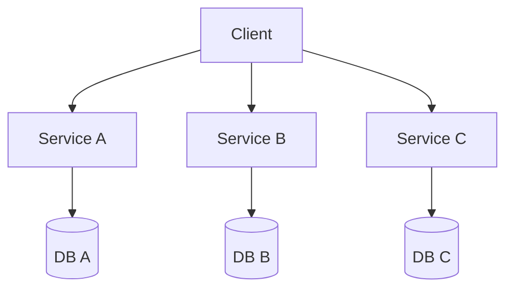

## Diagram

## Summary
The system is decomposed into small, independently deployable services, each owning its own data store and communicating over the network. Each service aligns to a bounded context and can be developed, scaled, and deployed by a dedicated team without coordinating with others.

## When To Use
- Multiple teams need to develop, deploy, and scale services independently
- Different services have significantly different scaling or resource requirements
- Frequent, independent releases are a business requirement
- The domain is well-understood and bounded contexts are stable

## When To Avoid
- Team is small — the operational overhead (CI/CD, observability, service discovery) exceeds the coordination benefit
- Domain boundaries are unclear — premature decomposition creates a Distributed Monolith
- Strong data consistency is required — distributed transactions are complex and costly
- The team lacks experience with distributed systems debugging and eventual consistency

## Pros and Cons

* Good, because services deploy independently — a release in one does not risk others
* Good, because each service scales, replicates, and is optimized independently
* Good, because technology heterogeneity is possible — each service chooses its own stack
* Bad, because distributed systems add latency, partial failure modes, and operational complexity
* Bad, because data consistency across services requires eventual consistency or Sagas
* Bad, because testing requires service virtualization or a full environment spin-up

## Evolutions
- **From:** Modular Monolith or Service-Based Architecture (extract fine-grained independently deployable services)
- **To:** Service Mesh (add traffic management layer), BFF (add per-client API aggregation), Cell-Based Architecture (group services into isolated cells)
