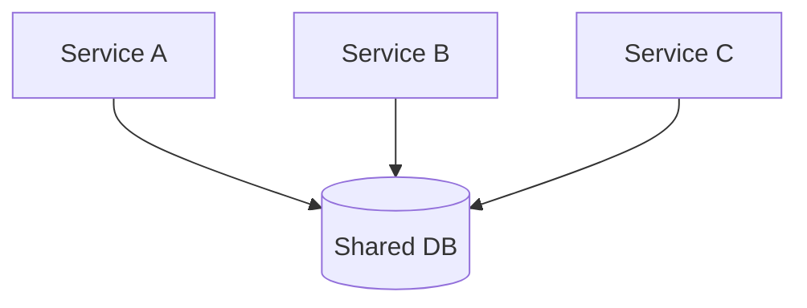

## Diagram

## Summary
Decomposes the system into a small number of independently deployable, coarse-grained services — typically four to twelve — that often share a common database. Each service aligns to a major business capability (e.g., ordering, inventory, billing) and can be deployed on its own schedule. The shared database simplifies data consistency compared to full microservices while still allowing teams to own and release their service independently.

## When To Use
- The team needs independent deployment of major capabilities without the full operational overhead of microservices
- A shared database is acceptable and avoids the complexity of distributed transactions across service boundaries
- Domain boundaries are clear enough to justify separate deployables but too coarse for fine-grained microservice decomposition
- Moving incrementally away from a monolith without committing to a full microservices migration

## When To Avoid
- Services have dramatically different scaling requirements that the shared database cannot accommodate
- The number of services grows beyond twelve or so — at that point, full microservices governance tooling is needed anyway
- Strong data isolation is required between services — the shared database couples schema evolution across teams

## Pros and Cons

* Good, because independent deployment of coarse services removes the full-monolith deployment risk without full distributed system complexity
* Good, because a shared database avoids distributed transactions and keeps data consistency simple
* Good, because a pragmatic middle ground — lower operational overhead than microservices, more deployment independence than a monolith
* Bad, because the shared database creates schema coupling between services — a migration in one service may break another
* Bad, because coarse service boundaries may not align to future organizational or scaling needs, requiring re-decomposition
* Bad, because inter-service calls are still over the network, introducing latency and partial failure modes that in-process calls avoid

## Evolutions
- **From:** Modular Monolith (extract major modules into separately deployable services while retaining a shared database)
- **To:** Microservices (split the shared database per service and decompose further once boundaries and operational maturity warrant it), Macroservices (consolidate if services are too fine-grained for the team size)
