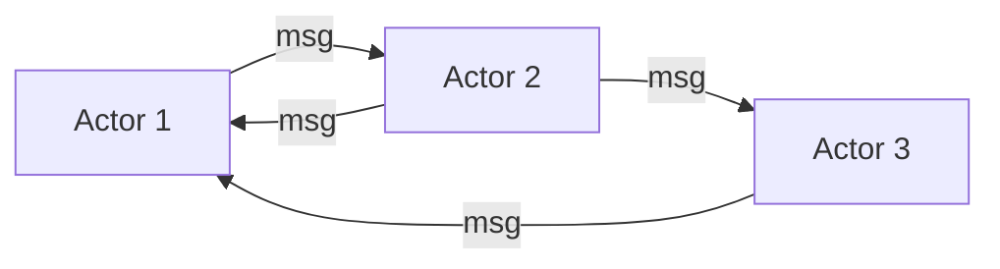

## Diagram

## Summary
Each actor is an independent, lightweight state machine that owns its private state and communicates exclusively via asynchronous messages. Actors are the unit of distribution: the runtime places and rebalances them across nodes transparently, enabling horizontal scaling of stateful workloads without shared memory or distributed locks.

## When To Use
- Workload maps naturally to independent, long-lived entities with private state (users, sessions, game characters, IoT devices)
- High concurrency is required without the complexity of explicit locking or synchronization
- Fine-grained fault isolation is needed — a crashed actor does not take down its neighbors
- The system needs location transparency: callers should not know or care which node an actor lives on

## When To Avoid
- Entities are not naturally isolated and require frequent coordination or transactions across many actors
- The programming team is unfamiliar with message-passing concurrency; the model inverts typical OO thinking
- Latency budgets are extremely tight — message-passing adds overhead compared to in-process calls
- State is predominantly read-heavy with rare writes; the actor model adds complexity without concurrency benefit

## Pros and Cons

* Good, because each actor processes one message at a time, eliminating data races without explicit locking
* Good, because actors are distributed across nodes automatically, giving stateful horizontal scaling
* Good, because supervisor hierarchies enable structured fault recovery and self-healing
* Bad, because request patterns that require coordinating many actors suffer from message-round-trip latency
* Bad, because debugging and tracing are harder — causality chains span asynchronous message hops
* Bad, because actor frameworks (Akka, Orleans, Erlang/OTP) carry significant learning curve and operational complexity

## Evolutions
- **From:** Shards (Actors are shards of state at the individual-entity granularity rather than at the partition level)
- **To:** Virtual Actors / Grains (runtime manages actor lifecycle transparently — Orleans, Dapr) or Event Sourcing (actor state persisted as an append-only event log)
