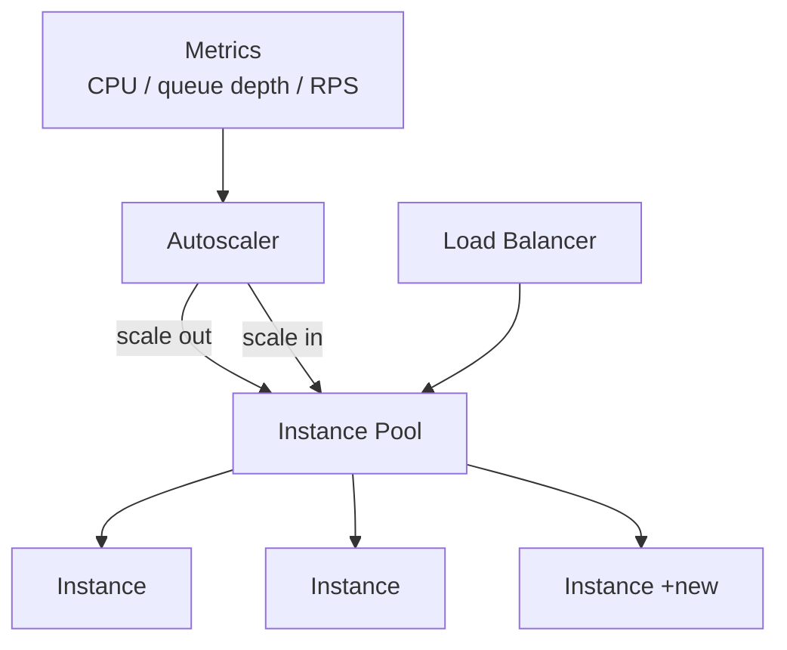

## Diagram

## Summary

Adjusts the number of running instances automatically in response to load, adding capacity when demand rises and removing it when demand falls. An autoscaler watches signals — CPU, request rate, queue depth, or custom metrics — and changes the pool size against configured targets and bounds. Scaling can be reactive (respond to current load) or predictive (anticipate load on a schedule or forecast). The pattern requires instances to be stateless and interchangeable so any can be added or removed without disrupting sessions.

## When To Use

- Load varies significantly over time and provisioning for peak all the time is wasteful
- Instances are stateless and interchangeable, so capacity can change without session disruption
- A meaningful, low-latency signal (queue depth, request rate, CPU) tracks load closely enough to drive scaling

## When To Avoid

- Instances hold session or in-memory state that cannot be moved or reconstructed on scale-in
- Startup time is so long that new instances arrive after the load spike has passed
- Load is flat and predictable — fixed capacity is simpler and avoids scaling churn

## Pros and Cons

* Good, because capacity tracks demand — you pay for what you use rather than provisioning for peak continuously
* Good, because the system absorbs load spikes without manual intervention
* Bad, because scaling reacts with a delay — slow instance startup can leave the system under-provisioned during sudden spikes
* Bad, because aggressive or misconfigured thresholds cause flapping (rapid scale in/out), adding instability and cost

## Evolutions

- **From:** A fixed-size Stateless Pool provisioned for peak load
- **To:** Combine with Work Queue and Queue-Based Load Leveling (scale consumers on queue depth); extend to Geode for elastic capacity across multiple regions
