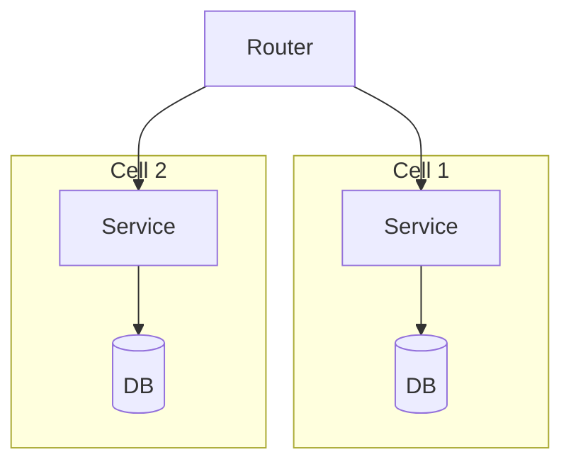

## Diagram

## Summary
Each shard is a fully self-contained replica of the entire system stack — routing, logic, and data — serving a fixed partition of users or tenants. A fault in one cell is fully contained and cannot cascade to others.

## When To Use
- Blast-radius containment is a primary requirement (multi-tenant SaaS, financial systems)
- Traffic can be partitioned by a stable, evenly distributed key (user ID, tenant ID, region)
- Independent cell scaling is more important than optimal resource utilization
- Compliance requires data isolation at the infrastructure level (GDPR, data residency)

## When To Avoid
- Requests must span multiple partitions — cross-cell queries require an expensive aggregation layer
- The partitioning key is not stable or unevenly distributed (hot partitions)
- Operational complexity of maintaining many identical stacks is not justified by the isolation benefit

## Pros and Cons

* Good, because a fault in one cell does not affect others — blast radius is bounded
* Good, because cells scale independently without touching the full system
* Good, because data locality simplifies compliance, auditing, and tenant isolation
* Bad, because cross-cell operations are expensive or prohibited
* Bad, because resource utilization is lower — each cell carries full stack overhead
* Bad, because operational burden (deployments, monitoring) multiplies with cell count

## Evolutions
- **From:** Shards (Cells add full-stack isolation on top of the basic shard concept)
- **To:** Cell-Based Architecture (formalized cell topology with a dedicated routing tier)
