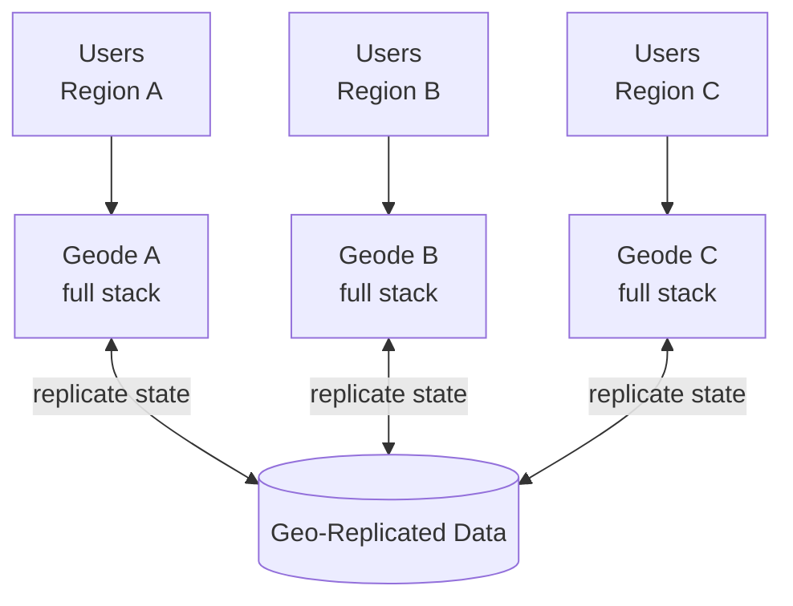

## Diagram

## Summary

Deploys a complete, independent copy of the workload (a "geode" — geographical node) to multiple regions, each able to serve any request. Traffic is routed to the nearest or healthiest region, cutting latency for geographically distributed users and providing availability if a region fails. Each geode runs the full stack and works against a data tier replicated across regions. The pattern trades data-consistency complexity for low latency and regional fault tolerance.

## When To Use

- Users are geographically dispersed and latency to a single region is unacceptable
- The system must survive the loss of an entire region (active-active availability)
- Read/write load can be served locally within each region with acceptable cross-region replication semantics

## When To Avoid

- Strong global consistency is required and the latency of cross-region coordination defeats the purpose
- The data model cannot tolerate the conflict resolution that multi-region writes require
- A single region adequately serves the user base — multi-region operational and cost overhead is unjustified

## Pros and Cons

* Good, because users are served from a nearby region, reducing latency
* Good, because the loss of one region does not take down the system — remaining geodes continue serving
* Bad, because keeping data consistent across regions is hard — replication lag and write conflicts must be handled
* Bad, because running and deploying a full stack in every region multiplies operational complexity and cost

## Evolutions

- **From:** A single-region deployment (optionally with Cells for in-region isolation)
- **To:** Add Polyglot Persistence patterns (Read Replicas, CQRS View) to tune per-region data access; combine with Autoscaling for elastic capacity within each region
