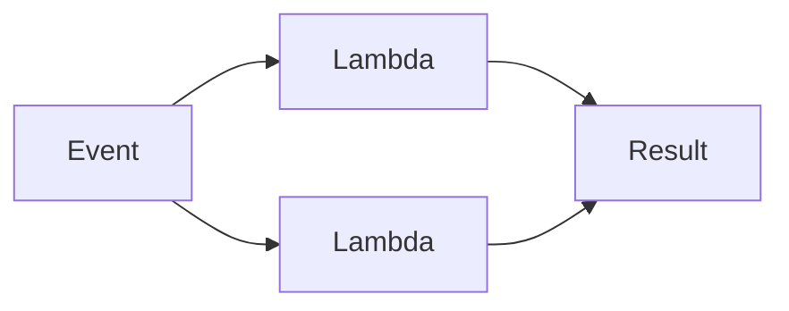

## Diagram

## Summary
Each invocation is handled by an ephemeral, single-use compute instance that is provisioned on demand, executes exactly one task, and is destroyed (or returned to a cold pool) immediately after. There is no persistent in-process state between invocations; billing and resource consumption are scoped to the duration of a single call, making the pattern ideal for spiky, event-driven workloads.

## When To Use
- Workloads are spiky or unpredictable and provisioning a standing pool would waste money during idle periods
- Tasks are short-lived and independently scoped — each invocation carries everything it needs
- Integration glue or event-driven pipelines need to react to external triggers (HTTP, queue messages, storage events) without managing infrastructure
- Per-invocation cost model is preferred over always-on instance pricing

## When To Avoid
- Invocations are long-running (minutes to hours) — most FaaS platforms impose hard timeouts
- Workloads are consistently high-throughput; cold-start overhead and per-invocation overhead exceed the cost of a standing pool
- Significant in-memory state or large working sets are required across requests — cold starts reload everything from external storage on each invocation
- The function footprint is large (heavy dependencies, GPU, specialized runtimes) and cold-start latency is unacceptable

## Pros and Cons

* Good, because scaling is automatic and infinite — the platform spawns one instance per concurrent invocation
* Good, because cost is proportional to actual work; idle time has zero infrastructure cost
* Good, because operational burden is minimal — no servers, patches, or capacity planning for the runtime itself
* Bad, because cold-start latency spikes when instances are not warm, degrading p99 latency
* Bad, because execution time limits and statelessness force external state management, complicating workflows that span multiple steps
* Bad, because observability is harder — distributed traces must stitch together many ephemeral instances, and local debugging diverges from production behavior

## Evolutions
- **From:** Stateless Pool (Lambdas take statelessness to the extreme — instances exist only for a single invocation)
- **To:** Durable Functions / Workflows (step functions or durable orchestrators add state machines across lambda invocations), or Container-based FaaS (longer-running, heavier runtimes with reduced cold-start penalty)
