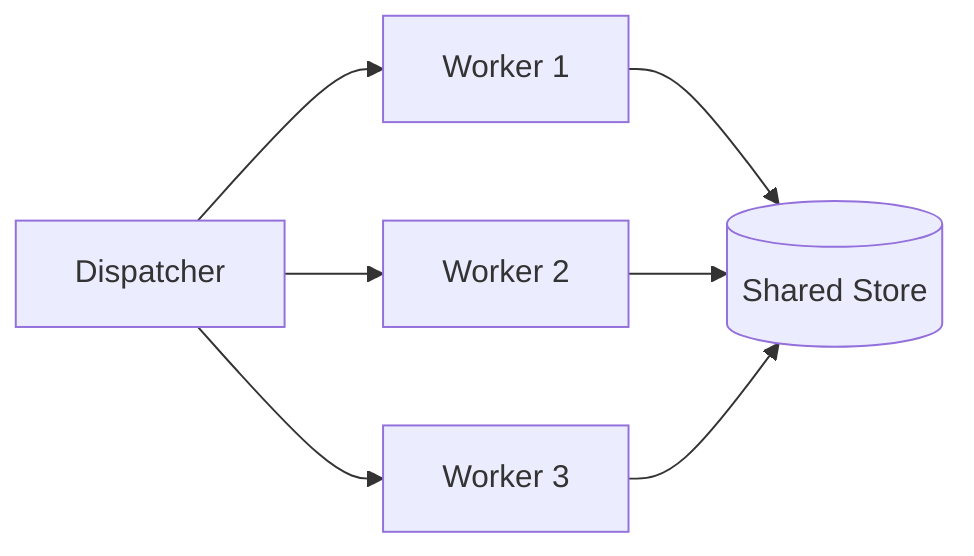

## Diagram

## Summary
A set of identical, stateless service instances sits behind a load balancer; any instance can handle any request because no request-local state is stored in the instance itself. All durable state is externalized to a shared store such as a database or cache, making instances fully interchangeable and trivially replaceable.

## When To Use
- The service is naturally stateless or state can be cleanly offloaded to an external store
- Elastic scaling is required — the pool shrinks and grows in response to load without coordination
- High availability is a priority: instance failure should be invisible to callers
- Rolling deployments, canary releases, or A/B testing are needed without user-session stickiness

## When To Avoid
- Requests require low-latency access to large, instance-local working sets that cannot be shared economically
- The external state store becomes a bottleneck or single point of failure, negating the benefits of pooling
- Strict request ordering per client is required and cannot be encoded into the external store
- Latency to the external store is prohibitive for the access pattern (e.g., high-frequency in-memory cache misses)

## Pros and Cons

* Good, because scaling is as simple as adding or removing instances — no resharding or data migration
* Good, because any instance can serve any request, so load balancers require no affinity logic
* Good, because instance failure is recoverable by any other pool member without state loss
* Bad, because all state reads and writes traverse the network to an external store, adding latency per request
* Bad, because the external store must scale with the pool, potentially shifting the bottleneck rather than eliminating it
* Bad, because session-like patterns (e.g., multi-step workflows) require explicit external state management, increasing application complexity

## Evolutions
- **From:** Shards (stateless pool is the simplest sharding strategy — every instance is a peer shard of compute)
- **To:** Cells (add full-stack isolation per partition), Lambdas (push statelessness to per-invocation ephemeral instances), or Caching Layer (reduce external-store pressure with in-pool read caches)
