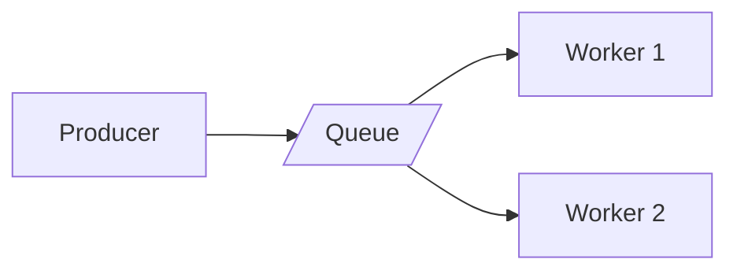

## Diagram

## Summary
A pool of identical worker instances pulls tasks from a shared, durable queue. Workers are stateless and interchangeable — any worker can execute any task. The queue acts as a buffer that absorbs bursts, provides backpressure, and guarantees at-least-once delivery, decoupling task producers from task executors.

## When To Use
- Work arrives in bursts and processing speed is slower than arrival rate — the queue absorbs the spike
- Tasks are independent and do not require ordering across different task types
- Fault tolerance is required: a crashed worker should not lose the task it was processing
- Processing throughput must scale horizontally by adding more workers without changing producers

## When To Avoid
- Tasks must be processed in strict global order — a single consumer becomes a bottleneck
- Task latency must be sub-millisecond; queue round-trips add inherent latency
- Tasks have complex interdependencies that require coordinated scheduling beyond simple FIFO or priority
- The overhead of a persistent queue infrastructure is not justified for lightweight, in-process work

## Pros and Cons

* Good, because producers and consumers are fully decoupled — each scales independently
* Good, because the queue provides durability; tasks survive worker crashes and restarts
* Good, because backpressure is natural — an overwhelmed system slows producers without dropping work
* Bad, because at-least-once delivery requires workers to be idempotent, adding design complexity
* Bad, because end-to-end latency increases compared to synchronous processing
* Bad, because queue depth monitoring, dead-letter handling, and poison-message management add operational overhead

## Evolutions
- **From:** Shards (work-queue shards the workload across worker instances by distributing individual tasks)
- **To:** Partitioned Queues (tasks routed to specific partitions for ordering guarantees), Priority Queues (multiple queues with different service levels), or Stream Processing (Kafka-style ordered log replaces the queue)
