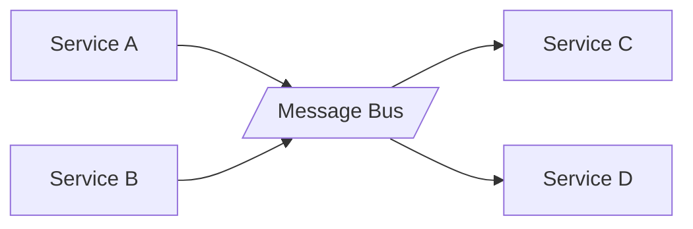

## Diagram

## Summary
An intermediary component between services that handles routing, transformation, and delivery of messages. Services communicate exclusively through the middleware — they have no direct knowledge of each other. Enables loose coupling across services without requiring synchronous point-to-point connections.

## When To Use
- Multiple services need to communicate without direct coupling
- Fan-out (one message to many consumers) or fan-in (many sources to one processor) is required
- The system must buffer traffic to absorb burst load or handle backpressure
- Message routing, transformation, or protocol translation is needed between components

## When To Avoid
- Two services communicate exclusively with each other — a direct call is simpler
- Latency budget is too tight for message broker round-trip overhead
- The middleware would become a single point of failure that outweighs its decoupling value
- The team lacks operational experience with message brokers

## Pros and Cons

* Good, because services are decoupled — either side can be replaced without the other knowing
* Good, because the broker absorbs traffic spikes through buffering
* Good, because routing and transformation logic is centralized and reusable
* Bad, because the middleware is a shared operational dependency — its failure affects all services
* Bad, because async messaging complicates error handling and end-to-end tracing
* Bad, because adds latency and infrastructure cost compared to direct service-to-service calls

## Evolutions
- **From:** Services (add middleware to decouple point-to-point connections)
- **To:** Message Broker (concrete implementation), Service Mesh (per-service traffic management), Enterprise Service Bus (add orchestration and transformation)
