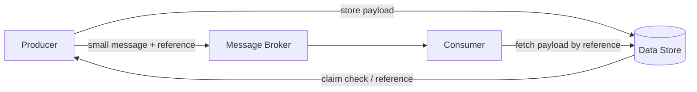

## Diagram

## Summary

Splits a large message so the bulk payload is stored externally and only a small reference (the claim check) travels through the messaging system. The producer writes the payload to a data store, obtains a reference, and sends a lightweight message carrying that reference; the consumer retrieves the payload from the store when needed. This keeps the message broker fast and within size limits, avoids moving large blobs through the queue, and lets payloads be fetched only when required.

## When To Use

- Messages carry payloads too large for the broker's limits or too costly to move through it (media, documents, datasets)
- Not every consumer needs the full payload — the reference is enough for routing and filtering
- Broker throughput and cost degrade when large blobs pass through it

## When To Avoid

- Payloads are small — the extra store round-trip adds latency for no benefit
- The external store's availability or latency would undermine reliable message processing
- Payload lifecycle and cleanup cannot be managed, risking orphaned or prematurely deleted blobs

## Pros and Cons

* Good, because the broker handles small, uniform messages — throughput and cost stay predictable regardless of payload size
* Good, because payloads are fetched on demand, so consumers that only need metadata avoid transferring the blob
* Bad, because it introduces a second dependency (the data store) into the message path, adding a failure mode and a fetch round-trip
* Bad, because payload lifecycle must be coordinated with message lifecycle — orphaned or expired references cause errors

## Evolutions

- **From:** Embedding full payloads directly in broker messages
- **To:** Pair with Cache-Aside for frequently re-read payloads; use a Persistent Event Log when references must remain resolvable for replay
