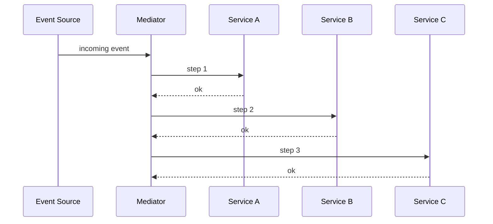

## Diagram

## Summary
A central component that receives events and orchestrates a multi-step workflow by calling services in a defined sequence. Unlike pure event-driven choreography where services react independently, the mediator is aware of the full workflow and actively coordinates each step. It combines the loose coupling of messaging with the explicit control flow of an orchestrator.

## When To Use
- A multi-step workflow must be driven by events but the sequence of steps must be centrally visible and controlled
- Complex conditional logic determines which services are called and in what order based on event content
- Error handling and compensation steps must be coordinated centrally when a workflow step fails
- The same incoming event type can trigger different workflows depending on context

## When To Avoid
- Services are truly independent and can react to events without any central coordination — pure choreography is simpler
- The mediator's workflow logic is nearly identical to a direct orchestrator — use an orchestrator instead
- The workflow is so simple that routing through a mediator adds unnecessary indirection
- High-throughput event processing is needed and the mediator would become a serialization bottleneck

## Pros and Cons

* Good, because workflow logic is centralized — the mediator is the single place to understand and modify a multi-step process
* Good, because services participating in the workflow remain decoupled — they communicate through events, not direct calls
* Good, because the mediator can retry, reroute, or compensate without the participating services needing that logic
* Bad, because the mediator becomes a central dependency — changes to any participating service may require updating it
* Bad, because adds complexity compared to either direct service calls or pure choreography
* Bad, because if the mediator fails, all in-flight workflows are interrupted and may require manual recovery

## Evolutions
- **From:** Message Broker (add workflow-awareness and sequence control to pure routing)
- **To:** Enterprise Service Bus (add protocol mediation and transformation), Saga (formalize compensation and distributed transaction semantics)
