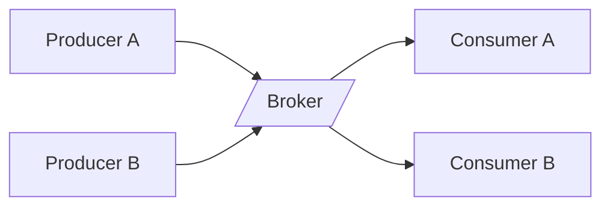

## Diagram

## Summary
A dedicated service that receives messages from producers, routes them to the correct consumers, and optionally persists them until delivery is confirmed. Producers and consumers are fully decoupled in both time and topology — a producer does not know which consumers exist, and a consumer does not need to be running when a message is published.

## When To Use
- Producers and consumers must be decoupled so either side can be deployed, scaled, or replaced independently
- Consumers need to process messages at their own rate, buffering spikes from high-volume producers
- Multiple consumers need to receive the same message (pub/sub fan-out)
- Guaranteed delivery and at-least-once or exactly-once processing semantics are required

## When To Avoid
- The interaction is synchronous and request/response — a direct HTTP or RPC call is simpler
- Message volume is very low and the infrastructure cost of a broker is not justified
- Ordering guarantees across many topics or partitions are required — most brokers only guarantee per-partition order
- The team lacks operational experience with broker administration, monitoring, and dead-letter queue management

## Pros and Cons

* Good, because producers and consumers are fully decoupled — either side can change without the other knowing
* Good, because the broker buffers messages, smoothing out traffic spikes and protecting downstream services
* Good, because pub/sub allows new consumers to subscribe without any change to the producer
* Bad, because the broker is a new operational dependency — its failure or misconfiguration can halt the entire pipeline
* Bad, because debugging end-to-end flows is harder because the call chain is no longer synchronous
* Bad, because message schema evolution requires coordination — breaking changes affect all consumers silently until they fail

## Evolutions
- **From:** Middleware (Message Broker is a concrete implementation of the Middleware metapattern)
- **To:** Persistent Event Log (add durable, replayable event retention), Enterprise Service Bus (add orchestration, transformation, and protocol mediation)
