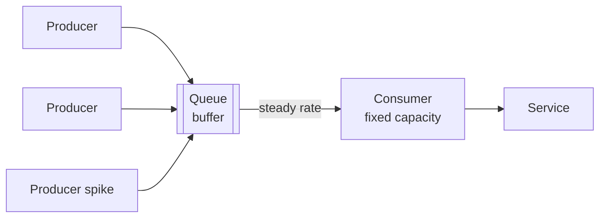

## Diagram

## Summary

Places a queue between producers and a consuming service so the consumer processes work at its own steady rate regardless of how bursty the incoming load is. The queue absorbs spikes: producers enqueue as fast as they arrive, while the consumer dequeues at a sustainable pace. This decouples the two, protects the consumer (and downstream resources) from being overwhelmed, and smooths peaks into a manageable flow at the cost of added latency during bursts.

## When To Use

- Producer load is bursty but the consumer or a downstream resource has finite, relatively fixed throughput
- Overload would cause failures or throttling that the system should absorb rather than propagate
- Some processing latency during spikes is acceptable in exchange for stability

## When To Avoid

- Requests need synchronous, immediate responses — buffering adds latency incompatible with real-time interaction
- The consumer can already scale fast enough to meet peak load directly (see Autoscaling)
- The queue would grow unbounded because average load exceeds consumer capacity — leveling only smooths spikes, not sustained overload

## Pros and Cons

* Good, because the consumer and downstream resources are shielded from spikes — they run at a stable, provisioned rate
* Good, because producers and consumers are decoupled and can fail or scale independently
* Bad, because buffering adds latency during bursts — work waits in the queue instead of being processed immediately
* Bad, because sustained load above consumer capacity makes the queue grow without bound unless paired with scaling or backpressure

## Evolutions

- **From:** Producers calling the consumer synchronously and overloading it during spikes
- **To:** Add Autoscaling on queue depth so consumer capacity grows with backlog; combine with Competing Consumers (Work Queue) to parallelize draining
