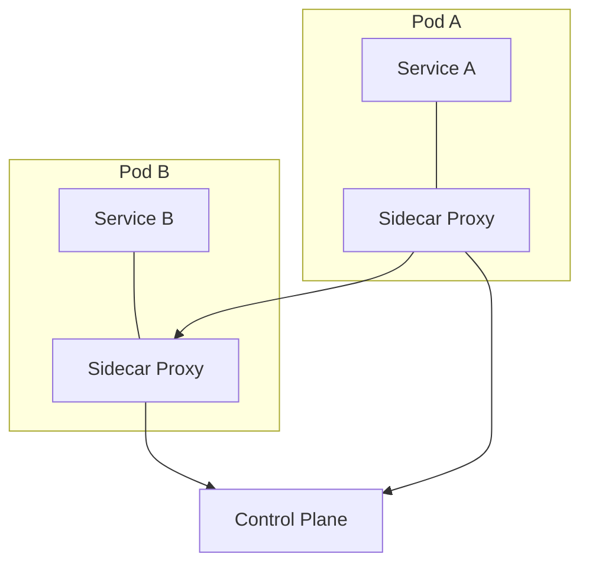

## Diagram

## Summary
A dedicated infrastructure layer, typically implemented as co-deployed sidecar proxies alongside each service instance, that handles all service-to-service communication: load balancing, retries, circuit breaking, mTLS encryption, and distributed tracing. Application code is completely unaware of the mesh — it communicates as if talking directly to peers, while the sidecar intercepts all traffic transparently.

## When To Use
- Cross-cutting network concerns (retries, circuit breaking, mTLS, observability) must be applied uniformly without modifying application code
- The system runs many heterogeneous services in multiple languages where a shared library approach is impractical
- Zero-trust networking is required — all service-to-service traffic must be mutually authenticated and encrypted
- Consistent observability (traces, metrics, logs) is needed across all services without per-service instrumentation

## When To Avoid
- The service count is small (fewer than a handful) — the operational overhead of a mesh control plane is not justified
- The team lacks expertise to operate a mesh control plane and debug sidecar-level networking issues
- Ultra-low latency is required — the sidecar adds measurable overhead to every service call
- Services already handle their own resilience patterns consistently through a shared library

## Pros and Cons

* Good, because network policy (retries, timeouts, circuit breakers, mTLS) is applied uniformly without touching service code
* Good, because distributed tracing and metrics are available for all services automatically
* Good, because traffic shifting, canary deployments, and A/B testing are controlled centrally via mesh configuration
* Bad, because the control plane (and its configuration) adds significant operational complexity
* Bad, because sidecar proxies consume CPU and memory on every service instance
* Bad, because debugging failures can be challenging because the problem may be in the sidecar rather than the application

## Evolutions
- **From:** Middleware (Service Mesh is a per-service, sidecar-based specialization of the Middleware concept)
- **To:** Extended observability platforms (integrate mesh telemetry with APM), Zero-trust security platforms (mesh as the enforcement point for identity-based policy)
