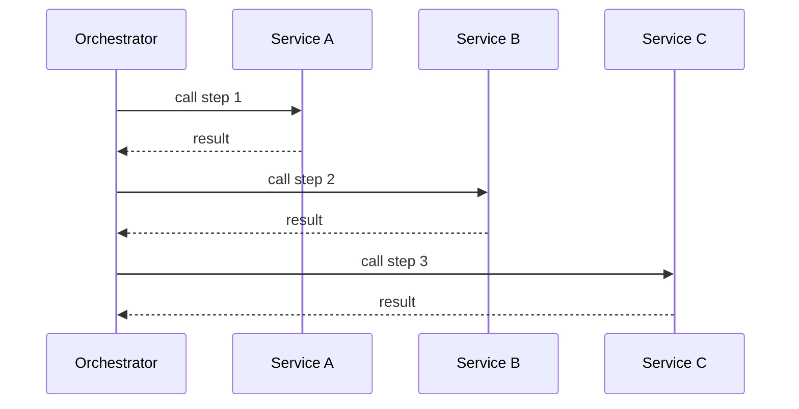

## Diagram

## Summary
A central coordinator that knows the steps of a workflow and explicitly calls each participant service in the correct sequence. The orchestrator holds all control-flow logic; participants are passive and unaware of the larger workflow. This contrasts with choreography, where services react autonomously to events without a central authority directing them.

## When To Use
- A workflow spans multiple services and the sequence must be explicit and centrally visible
- Compensating actions must be coordinated when a step fails (distributed transactions, sagas)
- Business analysts or operators need to see and reason about the workflow as a single unit
- The interaction pattern is complex enough that event-driven choreography would be hard to trace and test

## When To Avoid
- Services are highly autonomous and should evolve independently — an orchestrator creates coupling to all participants
- The workflow is simple enough to be expressed as a single service or transaction script
- Very high throughput is needed and the orchestrator would become a bottleneck
- The team is practicing domain-driven design with strong bounded contexts — choreography preserves autonomy better

## Pros and Cons

* Good, because the workflow logic is centralized and explicit — easy to read, trace, and monitor
* Good, because failure handling and compensation are owned in one place
* Good, because participants remain simple and focused — they only do their own job
* Bad, because the orchestrator becomes a point of coupling — changes to any participant may require updating it
* Bad, because if the orchestrator fails, the entire workflow stalls
* Bad, because orchestrators tend to accumulate domain logic over time, becoming a distributed monolith hub

## Evolutions
- **From:** Choreography / event-driven services (introduce orchestrator when workflow becomes hard to follow)
- **To:** Saga (add compensating transactions for distributed consistency), API Composer (aggregation-focused orchestration), Workflow Engine (externalize the orchestration state machine)
