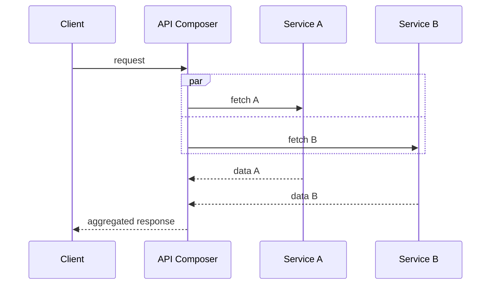

## Diagram

## Summary
Aggregates responses from multiple downstream services into a single composed response for the client. The API Composer calls each required service (sequentially or in parallel), collects their results, and merges them into a unified response. This reduces client round-trips, hides backend service decomposition from clients, and centralizes fan-out logic server-side.

## When To Use
- Clients need data that is split across multiple microservices and making multiple round-trips would be costly or complex
- The API surface must remain stable for clients even as backend services are decomposed or reorganized
- Parallel fan-out to multiple services can be exploited server-side to reduce total latency compared to sequential client calls
- Backend for Frontend (BFF) patterns require aggregating data specifically shaped for a particular client type

## When To Avoid
- Data from all required services is already served by a single service — no aggregation is needed
- The composition logic encodes significant business rules — the composer should not become a second domain layer
- Service calls cannot be made in parallel and the sequential total latency would be worse than client-side calls
- Partial failures in downstream services need to be surfaced to the client in detail — a composer may obscure them

## Pros and Cons

* Good, because clients make a single request instead of multiple, reducing round-trips and simplifying client code
* Good, because backend service decomposition is hidden from clients — services can be split or merged without client changes
* Good, because parallel fan-out in the composer can reduce total response time compared to sequential client calls
* Bad, because the composer must handle partial failures — if one downstream service fails, the entire composed response is affected
* Bad, because the composer can accumulate business logic over time, creating a hidden orchestration layer
* Bad, because a single slow downstream service blocks the entire composed response unless careful timeout and fallback logic is implemented

## Evolutions
- **From:** Orchestrator (API Composer is an orchestrator focused on response aggregation for clients)
- **To:** GraphQL (consumer-driven composition where the client specifies what to aggregate), BFF (per-client API Composer instances tuned to specific client needs)
