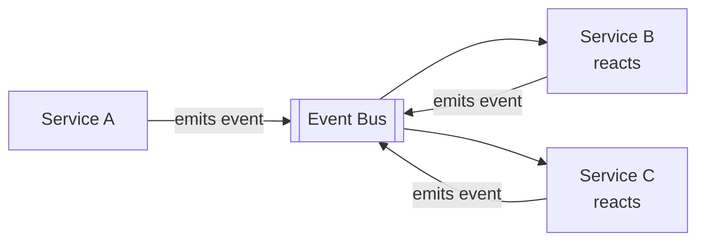

## Diagram

## Summary

Coordinates a multi-step workflow without a central controller: each service reacts to events and emits its own, and the overall process emerges from these local reactions. It is the decentralized counterpart to orchestration — instead of a coordinator directing each participant, participants respond to a shared event stream. This removes the orchestrator as a bottleneck and coupling point, letting services evolve and scale independently, at the cost of a process flow that is implicit and spread across many services.

## When To Use

- Services should be autonomous and loosely coupled, with no central component owning the workflow
- The process is event-driven and steps can proceed reactively as events arrive
- Avoiding an orchestrator bottleneck or single point of coupling is a priority

## When To Avoid

- The workflow needs central visibility, control, or explicit state — an Orchestrator (e.g. Saga orchestration) is clearer
- Complex branching, compensation, or ordering logic is hard to follow when distributed across many reactive handlers
- Debugging and tracing an emergent, implicit flow would exceed the team's operational capability

## Pros and Cons

* Good, because there is no central coordinator to become a bottleneck or single point of failure
* Good, because services are decoupled — each only knows the events it consumes and emits, so they evolve independently
* Bad, because the end-to-end process is implicit and scattered across services, making it hard to understand and trace
* Bad, because cross-cutting concerns like compensation, ordering, and error handling are harder to reason about without a central owner

## Evolutions

- **From:** Orchestrated coordination where a central component (Saga orchestrator, Service Layer) directs each step
- **To:** Introduce an Event Mediator or Persistent Event Log for traceability; adopt orchestrated Saga where central control and compensation become necessary
