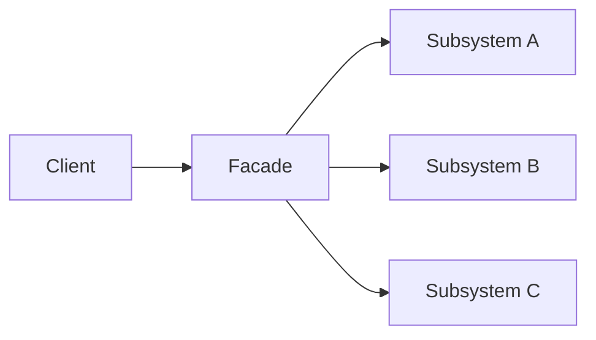

## Diagram

## Summary
A simplified interface to a complex subsystem. The facade delegates to the subsystem's components and hides their complexity from callers — callers interact with a single, cohesive API rather than coordinating multiple subsystem classes directly. The subsystem components remain available for callers that need fine-grained control, but most callers use the facade.

## When To Use
- A complex subsystem has many classes or services and providing a simple interface for the most common use cases reduces friction
- A layered architecture needs a defined entry point to each layer that prevents upper layers from accessing lower-layer internals directly
- Legacy systems have complex, scattered APIs and a facade can provide a clean modern interface while the legacy internals remain unchanged
- Testing is hindered by subsystem complexity — a facade simplifies mocking and isolating the subsystem

## When To Avoid
- The subsystem is already simple and the facade would add indirection without simplifying anything
- Callers have genuinely different needs that require full access to subsystem internals — the facade would be a leaky abstraction
- The facade accumulates business logic and becomes a god object or orchestration hub rather than a thin interface
- The pattern is used solely to hide poor subsystem design rather than to genuinely simplify a legitimately complex system

## Pros and Cons

* Good, because shields callers from subsystem complexity — the most common operations are accessible through a clean API
* Good, because reduces coupling between clients and the subsystem — only the facade surface is exposed
* Good, because the subsystem can be refactored internally without affecting callers as long as the facade interface is stable
* Bad, because the facade can become a bottleneck if all traffic flows through it and it accumulates unrelated responsibilities
* Bad, because a poorly designed facade may not expose enough of the subsystem, forcing callers to bypass it for uncommon use cases
* Bad, because can give a false sense of simplicity while hiding design debt in the subsystem rather than addressing it

## Evolutions
- **From:** Orchestrator (Facade is an orchestrator that coordinates a subsystem behind a simplified interface)
- **To:** API Gateway (externalize the facade for remote clients), Service Layer (formalize the facade as the application's transaction boundary)
