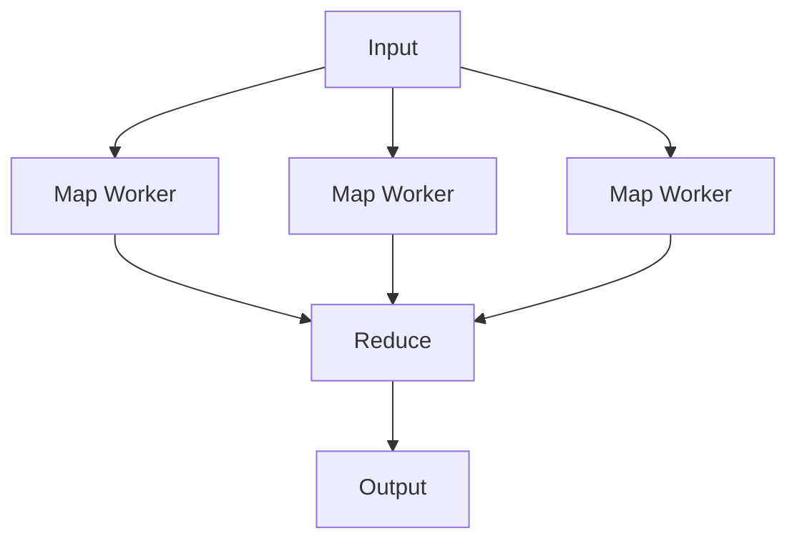

## Diagram

## Summary
A parallel data processing pattern where an orchestrator distributes work across multiple nodes (the Map phase — applying a function independently to each element or partition) and then aggregates the results (the Reduce phase — combining the intermediate outputs into a final result). Enables processing of datasets far larger than a single machine can handle by exploiting data parallelism.

## When To Use
- A large dataset must be processed and the processing of each element or partition is independent of others
- Processing time on a single machine would be unacceptable and the work can be partitioned without coordination between workers
- The same transformation must be applied uniformly to all input elements
- Fault tolerance is required — if a worker fails, its partition can be reassigned to another worker and retried

## When To Avoid
- The dataset is small enough to process efficiently on a single machine — distributed coordination overhead would dominate
- Processing steps are sequentially dependent and each step requires the full output of the previous step
- Low-latency, real-time processing is required — MapReduce is a batch-oriented pattern with high start-up overhead
- The reduce step requires sorting or merging across all map outputs and the network shuffle cost is prohibitive

## Pros and Cons

* Good, because massive parallelism allows processing of data volumes that no single machine could handle within acceptable time
* Good, because the pattern is fault-tolerant — failed map or reduce tasks can be retried independently
* Good, because data locality can be exploited by running map tasks on the nodes where data resides, minimizing network transfer
* Bad, because high framework and coordination overhead makes it inefficient for small datasets or latency-sensitive workloads
* Bad, because the programming model is restrictive — not all algorithms decompose naturally into map and reduce functions
* Bad, because the shuffle phase (transferring map outputs to reduce workers) can become a network bottleneck for large result sets

## Evolutions
- **From:** Orchestrator (MapReduce is an orchestrator specialized for parallel distributed data processing)
- **To:** Streaming Processing (replace batch MapReduce with continuous stream processing for lower latency), Spark / DataFrame APIs (higher-level abstractions over the map-reduce execution model)
