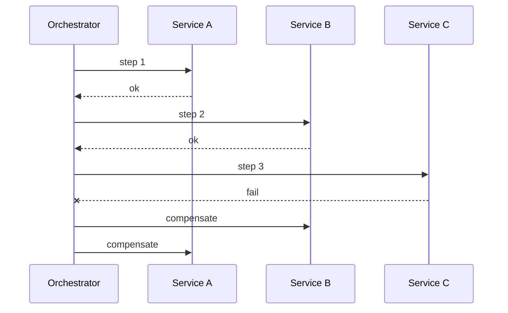

## Diagram

## Summary
Manages a long-running distributed transaction as a sequence of local transactions, where each step publishes an event or message that triggers the next step. If any step fails, the saga executes compensating transactions in reverse order to undo the work already completed by previous steps. Sagas can be implemented as choreography (event-driven, no central coordinator) or orchestration (a saga orchestrator directs each step).

## When To Use
- A business operation spans multiple microservices and each service owns its own database, making a single ACID transaction impossible
- The operation may run for a long time and holding distributed locks is not acceptable
- Eventual consistency is acceptable and compensating actions can meaningfully undo the effects of completed steps
- Clear audit trail and visibility into the state of a long-running distributed operation is required

## When To Avoid
- Operations require strict ACID guarantees across multiple resources — a distributed transaction protocol (2PC) may be necessary instead
- Compensating transactions cannot be made equivalent — some actions (e.g., sending an email) are not reversible
- The workflow is simple enough to be handled within a single service — the saga pattern adds significant complexity overhead
- The team lacks experience with eventual consistency and will struggle to reason about compensating transaction correctness

## Pros and Cons

* Good, because enables consistent multi-service workflows without requiring distributed locking or two-phase commit
* Good, because each service participates through local transactions only, preserving service autonomy and independent scaling
* Good, because failure is handled explicitly through compensating transactions — the failure path is as well-defined as the success path
* Bad, because compensating transactions are complex to design correctly — especially for partially completed side effects
* Bad, because the system is in a temporarily inconsistent state between saga steps — consumers may observe intermediate states
* Bad, because debugging failed sagas and determining the correct compensation sequence requires careful state tracking and logging

## Evolutions
- **From:** Orchestrator (Saga is an orchestrator specialized for distributed transactions with explicit compensation)
- **To:** Event Sourcing (capture saga state transitions as events), Workflow Engine (externalize the saga state machine to a dedicated platform)
