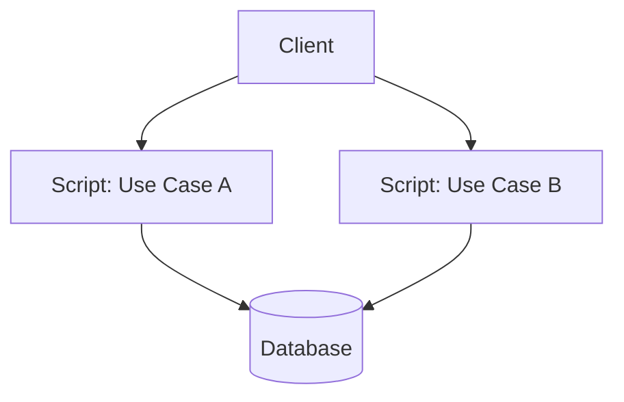

## Diagram

## Summary
Business logic is organized as a single procedural script per use case that runs through a series of steps from start to finish. Each operation corresponds to one script that directly manipulates data, calls services, and handles errors in sequence. The approach is simple, explicit, and easy to trace — the entire flow is visible in one place.

## When To Use
- The application has simple business logic with limited domain complexity — no rich object relationships or invariants
- Rapid development is needed and the overhead of a domain model is not justified
- Use cases are distinct and do not share significant logic — each script is self-contained
- The team is small or less experienced with object-oriented domain modeling patterns

## When To Avoid
- Business logic grows complex enough that scripts become long, duplicated, and hard to maintain — a domain model is needed
- Multiple use cases share the same business rules and duplication across scripts leads to inconsistency
- The codebase already has rich domain objects and mixing transaction scripts with them creates architectural inconsistency
- The system requires extensive testing of business rules in isolation — transaction scripts are harder to unit test than domain objects

## Pros and Cons

* Good, because extremely simple to understand — each use case is a linear script with no framework or pattern overhead
* Good, because easy to trace execution — the entire operation is visible in one function or method
* Good, because fast to implement for simple CRUD operations and straightforward workflows
* Bad, because duplication proliferates as multiple scripts share the same business rules without a shared domain model to enforce them
* Bad, because scripts grow long and complex as business logic accumulates, becoming hard to read and maintain
* Bad, because testing business rules requires running the full script, making isolated unit testing of logic difficult

## Evolutions
- **From:** Orchestrator (Transaction Script is the simplest form of orchestration — a single linear procedure)
- **To:** Service Layer (introduce a service layer to coordinate domain objects as logic grows), Domain Model (extract shared business rules into rich domain objects)
